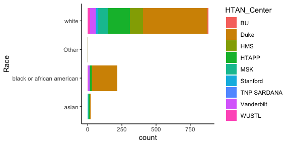
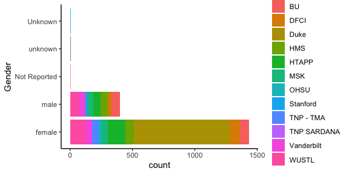

# 1. Introduction & Overview 

[HTAN](https://humantumoratlas.org/) is a National Cancer Institute (NCI)-funded Cancer Moonshot$^{SM}$ initiative to construct 3-dimensional atlases of the dynamic cellular, morphological, and molecular features of human cancers as they evolve from precancerous lesions to advanced disease ( [Cell April 2020](https://www.sciencedirect.com/science/article/pii/S0092867420303469) ).

Clinical data, sample biospecimen data and assay files in HTAN have a rich set of annotations supplied by HTAN data contributors.  These annotations are made according to the [HTAN Data model](https://data.humantumoratlas.org/standards), a set of standards defined by the HTAN consortium. The supplied values of these attributes have been collected into comprehensive data tables on the cloud, using the Google BigQuery structure that is part of Google Cloud Project.

### 1.1 Goal

This example notebook illustrates how to make use of HTAN Google BigQuery metadata tables to tabulate and plot available HTAN clinical, biospecimen, and assay metadata describing files available from [HTAN](https://data.humantumoratlas.org/). Summaries for other available metadata attributes can be generated by extending these examples.

### 1.2 Inputs, Outputs, & Data

The originating data can be found on the [HTAN Data Portal](https://data.humantumoratlas.org/), and the compiled tables are on the [Cancer Gateway in the Cloud](https://isb-cgc.appspot.com/).

### 1.3 Notes

The queries and results in this notebook correspond to HTAN Data Release 4. To choose a different release, edit the BigQuery table names in this notebook by replacing the string `r4` with a selected numbered release, e.g. `r2`. To get results for the most current data release, replace `r4` with `current` and `HTAN_versioned` with `HTAN`.  (For example replace `isb-cgc-bq.HTAN_versioned.clinical_tier1_demographics_r4` with `isb-cgc-bq.HTAN.clinical_tier1_demographics_current`).

# 2. Environment & Library Setup

```r
suppressMessages(library(tidyverse))
suppressMessages(library(bigrquery))
suppressMessages(library(knitr))
suppressMessages(library(reshape2))
```

# 3. Google Authentication

Running the BigQuery cells in this notebook requires a Google Cloud Project. Instructions for creating a project can be
found in [Google cloud documentation](https://cloud.google.com/resource-manager/docs/creating-managing-projects#console).
The instance needs to be authorized to bill the project for queries. For more information on getting started see
[Quick Start Guide to ISB-CGC](https://isb-cancer-genomics-cloud.readthedocs.io/en/latest/sections/HowToGetStartedonISB-CGC.html).
Alternative authentication methods can be found in the [Google Documentation](https://cloud.google.com/resource-manager/docs/creating-managing-projects#console).


```r
billing <- 'your_project_id' # Insert your project ID in the ''
if (billing == 'your_project_id') {
  print('Please update the project id with your Google Cloud Project')
}
```


# 4. Analyzing Clinical Data in HTAN

In the [HTAN Data model](https://data.humantumoratlas.org/standards), [Tier 1 Clinical Data](https://data.humantumoratlas.org/standard/clinical) has seven components: Demographics, Diagnosis, Exposure, Family History, Follow Up, Molecular Test, and Therapy. All HTAN demographic data is collected into a single Demographics table (*isb-cgc-bq.HTAN_versioned.clinical_tier1_demographics_r4*) in Google BigQuery containing data across all [HTAN Centers](https://humantumoratlas.org/research-network). The same is true of Diagnosis, and so on.

### 4.1 Demographics

Let's look at demographic distributions in HTAN. We begin by constructing an SQL query (as a string), then sending that as a query to HTAN Google BigQuery to retrieve the Demographics table. We remove a few unneeded bookkeeping columns.


```r
sql  <- "select * from `isb-cgc-bq.HTAN_versioned.clinical_tier1_demographics_r4`"
tb <- bq_project_query(billing, sql)
demographics <- bq_table_download(tb)
demographics <- demographics %>% select(-entityId,-Component, -Manifest_Id, -Manifest_Version, -Id) %>% distinct()
demographics$HTAN_Center <- gsub("HTAN ","",demographics$HTAN_Center)
```

The number of rows of this table is the number of participants for which demographics is reported:
nrow(demographics)=1947. The list of unique IDs of all HTAN Participants with demographic annotations is


```r
participant_list <- unique(demographics$HTAN_Participant_ID)
```

There are length(participant_list)=1938 participants with demographic annotations.

Participants per HTAN center

```r
participant_count_by_center <- demographics %>%
        select(HTAN_Center) %>%
        group_by(HTAN_Center) %>%
        tally()
participant_count_by_center %>% kable() 
```


|HTAN_Center |   n|
|:-----------|---:|
|BU          | 146|
|CHOP        |  30|
|DFCI        | 115|
|Duke        | 767|
|HMS         | 130|
|HTAPP       | 205|
|MSK         |  99|
|OHSU        |  15|
|Stanford    |  30|
|TNP - TMA   |  51|
|TNP SARDANA |   2|
|Vanderbilt  | 157|
|WUSTL       | 200|


You will see some differences between this table and the case counts on the [HTAN Data Portal]([HTAN](https://data.humantumoratlas.org/)).
(Some contributing factors: This notebook is fixed to HTAN data Release 4.0 while the portal has additional data;
the portal case inclusion criterion does not correspond to this simple row count.)

The number of columns in the Demographics table, ncol(demographics)=17, is the number of demographic
attributes. The attributes are

```r
colnames(demographics)
```

```
##  [1] "Age_Is_Obfuscated"         "Days_to_Birth"            
##  [3] "Occupation_Duration_Years" "Year_of_Death"            
##  [5] "Gender"                    "Vital_Status"             
##  [7] "Race"                      "Premature_At_Birth"       
##  [9] "Cause_of_Death_Source"     "HTAN_Participant_ID"      
## [11] "Weeks_Gestation_at_Birth"  "Days_to_Death"            
## [13] "Cause_of_Death"            "Year_Of_Birth"            
## [15] "Country_of_Residence"      "Ethnicity"                
## [17] "HTAN_Center"
```
These are the attributes of the HTAN [Clinical Tier 1 Demographics Data Model](https://data.humantumoratlas.org/standard/clinical),
along with a few general attributes.

#### 4.1.1 Race
Race is one of the Demographics attributes. Let's tabulate reported Race in HTAN and report the fraction as a percent. 

```r
demographics_race_reported <- demographics %>%
        filter(Race != "unknown" & Race != "Unknown" & Race != "Not Reported" & Race != "not allowed to collect" )
demographics_race_reported %>%
        group_by(Race) %>%
        tally() %>%
        mutate(Percent=round(100*n/nrow(demographics_race_reported),1)) %>%
        kable()
```


|Race                      |    n| Percent|
|:-------------------------|----:|-------:|
|Other                     |    9|     0.5|
|asian                     |   35|     2.0|
|black or african american |  294|    16.7|
|white                     | 1419|    80.8|

Here is a barchart showing the distribution

```r
demographics_race_reported %>% ggplot(aes(y=Race,fill=HTAN_Center)) + 
  geom_bar() + theme_classic() 
```



#### 4.1.2 Gender

Similarly, here's a barchart showing the breakdown by Gender.


```r
demographics_gender_reported <- demographics %>% filter(!Gender %in% c('Not Reported','unknown','Unknown')) %>% select(HTAN_Participant_ID,Gender,HTAN_Center) %>% distinct()
demographics_gender_reported %>%
        group_by(Gender) %>%
        tally() %>%
        mutate(Percent=round(100*n/nrow(demographics_gender_reported),1)) %>%
        kable()
```


|Gender |    n| Percent|
|:------|----:|-------:|
|female | 1471|    77.1|
|male   |  437|    22.9|


```r
demographics_gender_reported %>%
  ggplot(aes(y=Gender,fill=HTAN_Center)) +
  geom_bar() +
  theme_classic()
```



### 4.2 Treatment 

Let's take a look at annotated treatment in HTAN. This can be found in the Therapy table.


```r
sql  <- "select * from `isb-cgc-bq.HTAN_versioned.clinical_tier1_therapy_r4`"
tb <- bq_project_query(billing, sql)
therapy <- bq_table_download(tb)
therapy <- therapy %>% select(-entityId,-Component, -Manifest_Id, -Manifest_Version, -Id) %>% distinct()
therapy$HTAN_Center <- gsub("HTAN ","",therapy$HTAN_Center)
```

Now filter this table to retrieve instances of annotated therapy. 


```r
therapy_yes <- therapy %>%
    filter((Treatment_or_Therapy == "Yes" | !is.na(.$Treatment_Type) )
& !Treatment_Type %in% c("Not Reported","None","unknown","Not Reported,"))
```

These are 790 in number, for 387 participants.


By center and treatment type:

```r
therapy_yes %>%
  group_by(HTAN_Center,Treatment_Type) %>%
  tally() %>% arrange(desc(n)) %>%
  kable()
```


|HTAN_Center |Treatment_Type                         |   n|
|:-----------|:--------------------------------------|---:|
|MSK         |Chemotherapy                           | 117|
|HTAPP       |NA                                     | 115|
|HMS         |Chemotherapy                           |  68|
|MSK         |Surgery                                |  67|
|WUSTL       |Chemotherapy                           |  60|
|MSK         |External Beam Radiation                |  51|
|MSK         |Radiation External Beam                |  43|
|WUSTL       |Surgery                                |  31|
|MSK         |Targeted Molecular Therapy             |  28|
|CHOP        |Chemotherapy                           |  25|
|OHSU        |Hormone Therapy                        |  20|
|OHSU        |Targeted Molecular Therapy             |  19|
|MSK         |Immunotherapy (Including Vaccines)     |  16|
|DFCI        |Hormone Therapy                        |  12|
|HTAPP       |Surgery                                |  12|
|DFCI        |Chemotherapy                           |  11|
|WUSTL       |Concurrent Chemoradiation              |  11|
|OHSU        |Chemotherapy                           |  10|
|OHSU        |Immunotherapy (Including Vaccines)     |  10|
|MSK         |Other                                  |   9|
|OHSU        |Other                                  |   9|
|MSK         |Concurrent Chemoradiation              |   7|
|OHSU        |Radiation Therapy NOS                  |   7|
|HTAPP       |Chemotherapy                           |   6|
|MSK         |Stereotactic Radiosurgery              |   5|
|DFCI        |Targeted Molecular Therapy             |   4|
|WUSTL       |Radiation Therapy NOS                  |   3|
|MSK         |Pharmaceutical Therapy NOS             |   2|
|MSK         |Radiation Stereotactic/Gamma Knife/SRS |   2|
|MSK         |Radiation Therapy NOS                  |   2|
|WUSTL       |Radiation Stereotactic/Gamma Knife/SRS |   2|
|BU          |Chemotherapy                           |   1|
|DFCI        |Other                                  |   1|
|HTAPP       |Radiation Therapy NOS                  |   1|
|HTAPP       |Stereotactic Radiosurgery              |   1|
|MSK         |Radiation Cyberknife                   |   1|
|TNP SARDANA |Chemotherapy                           |   1|


# 5. Analyzing Biospecimen Data in HTAN

Biospecimen data in HTAN conforms to the [Biospecimen Data](https://data.humantumoratlas.org/standard/biospecimen) standard,
and all annotated values can be obtained in a single BigQuery table.


```r
sql <- "SELECT * FROM `isb-cgc-bq.HTAN_versioned.biospecimen_r4`"
tb <- bq_project_query(billing, sql)
biospecimen <- bq_table_download(tb)
biospecimen <- biospecimen %>% select(-entityId,-Component,-Manifest_Id, -Manifest_Version, -Id) 
biospecimen <- mutate(biospecimen,HTAN_Participant_ID=unlist(map(HTAN_Biospecimen_ID,participant_from_other_htan_id)))
```
Number of unique biospecimens : 7568, from 1722 participants.
Of these,  3683 list an HTAN Participant ID as Parent ID.

As an example, let's take a look at the various storage methods used for HTAN biospecimens

### 5.1 Storage Methods

```r
biospecimen_storage_noted <- biospecimen %>% filter(Storage_Method != "unknown" & Storage_Method != "Unknown" & Storage_Method != "Not Applicable")
table(biospecimen_storage_noted$Storage_Method,biospecimen_storage_noted$HTAN_Center) %>% kable()
```


|                          | HTAN BU| HTAN CHOP| HTAN DFCI| HTAN Duke| HTAN HMS| HTAN HTAPP| HTAN MSK| HTAN OHSU| HTAN Stanford| HTAN TNP - TMA| HTAN TNP SARDANA| HTAN Vanderbilt| HTAN WUSTL|
|:-------------------------|-------:|---------:|---------:|---------:|--------:|----------:|--------:|---------:|-------------:|--------------:|----------------:|---------------:|----------:|
|Ambient temperature       |      60|         0|         0|         0|      118|          0|        0|       105|             2|              0|                0|               0|          0|
|Fresh                     |      15|         0|         0|         0|        0|        516|       50|         0|             0|              0|                0|             181|          0|
|Frozen at -150C           |       0|         0|         0|         0|        0|         11|        0|         0|             0|              0|                0|               0|          0|
|Frozen at -80C            |     506|         0|        10|         0|      222|        297|        0|        43|             0|              0|                0|              51|        584|
|Frozen in liquid nitrogen |       0|        34|         0|         0|        0|         66|        8|         0|           233|              0|                0|               0|         14|
|Frozen in vapor phase     |       0|         0|         0|         0|        0|         41|        0|        14|             0|              0|                0|               0|          0|
|Paraffin block            |       0|         0|         0|      1229|        0|        125|       37|         0|             0|              0|                0|               1|          0|
|Refrigerated at 4 degrees |       0|         0|         0|         0|      477|          0|        0|         2|             0|           1432|               73|               0|          2|


# 6. Assay types in HTAN 

HTAN data is generated from multiple assay types, probing cancers and the tumor microenvironment at molecular, cellular, and tissue level,
using bulk, single-cell, and spatial assays. As described on the [HTAN Data Standards](https://data.humantumoratlas.org/standards)
page, generated data are arranged into data "Levels" corresponding to bioinformatic processing steps. In BigQuery, each
assay type and level is collected into a single table. 

For example, we can take a look at Single Cell RNA-seq Level 4 metadata by querying the table `isb-cgc-bq.HTAN_versioned.scRNAseq_level4_metadata_r4`


```r
sql <- "SELECT * FROM `isb-cgc-bq.HTAN_versioned.scRNAseq_level4_metadata_r4`"
tb <- bq_project_query(billing, sql)
scl4 <- bq_table_download(tb)
```

```
## Warning in as.integer.integer64(x): NAs produced by integer overflow
```

```r
scl4 %>% head(10) %>% kable() 
```


|entityId    |scRNAseq_Workflow_Parameters_Description       |Workflow_Version |HTAN_Data_File_ID |Id                                   |Component       |Workflow_Link                 |scRNAseq_Workflow_Type |File_Format |Filename                                                                                                                         |HTAN_Parent_Data_File_ID                                                                                                                                                                                                                                                                                                                                                                                                                                                                                                                                                                                                                                                                                                                                                                                                                                                                                                                                                                                                                                                                                                                                                                                                                                                                                                                                                                                                                                                                                                                                                                                                                                                                                                                                                                                                                                                                                                                                                                                                                                                                                                                                                                                                                                                                                                                                                                                                                                                                                                                                                                                                                                                                                                                                                                                                                                                                                                                                                                                                                                                                                                                                                                                                                                                                                                                                                                                                                                                                                                                                                                                                                                                                                                                                                                                                                                                                                                                                                                                                            |HTAN_Center |Manifest_Id | Manifest_Version| File_Size|md5                              |Data_Release |CDS_Release |
|:-----------|:----------------------------------------------|:----------------|:-----------------|:------------------------------------|:---------------|:-----------------------------|:----------------------|:-----------|:--------------------------------------------------------------------------------------------------------------------------------|:-----------------------------------------------------------------------------------------------------------------------------------------------------------------------------------------------------------------------------------------------------------------------------------------------------------------------------------------------------------------------------------------------------------------------------------------------------------------------------------------------------------------------------------------------------------------------------------------------------------------------------------------------------------------------------------------------------------------------------------------------------------------------------------------------------------------------------------------------------------------------------------------------------------------------------------------------------------------------------------------------------------------------------------------------------------------------------------------------------------------------------------------------------------------------------------------------------------------------------------------------------------------------------------------------------------------------------------------------------------------------------------------------------------------------------------------------------------------------------------------------------------------------------------------------------------------------------------------------------------------------------------------------------------------------------------------------------------------------------------------------------------------------------------------------------------------------------------------------------------------------------------------------------------------------------------------------------------------------------------------------------------------------------------------------------------------------------------------------------------------------------------------------------------------------------------------------------------------------------------------------------------------------------------------------------------------------------------------------------------------------------------------------------------------------------------------------------------------------------------------------------------------------------------------------------------------------------------------------------------------------------------------------------------------------------------------------------------------------------------------------------------------------------------------------------------------------------------------------------------------------------------------------------------------------------------------------------------------------------------------------------------------------------------------------------------------------------------------------------------------------------------------------------------------------------------------------------------------------------------------------------------------------------------------------------------------------------------------------------------------------------------------------------------------------------------------------------------------------------------------------------------------------------------------------------------------------------------------------------------------------------------------------------------------------------------------------------------------------------------------------------------------------------------------------------------------------------------------------------------------------------------------------------------------------------------------------------------------------------------------------------------------------------------|:-----------|:-----------|----------------:|---------:|:--------------------------------|:------------|:-----------|
|syn23626805 |Cell type composition of SCLC immune dataset   |Not available    |HTA8_4_100036     |1bdcefd7-d0a2-4c11-9a19-01a93139c70a |ScRNA-seqLevel4 |Not available                 |Other                  |txt         |single_cell_RNAseq_level_4/immune.SCLC_samples_only/celltypeComposition.immune.SCLC_samples_only.010920.txt                      |HTA8_1001_310001,HTA8_1001_310002,HTA8_1001_310003,HTA8_1001_310004,HTA8_1002_310001,HTA8_1002_310002,HTA8_1002_310003,HTA8_1002_310004,HTA8_1003_310001,HTA8_1003_310002,HTA8_1003_310003,HTA8_1003_310004,HTA8_1004_310001,HTA8_1004_310002,HTA8_1004_310003,HTA8_1004_310004,HTA8_1005_310001,HTA8_1005_310002,HTA8_1005_310003,HTA8_1005_310004,HTA8_1005_320001,HTA8_1005_320002,HTA8_1005_320003,HTA8_1005_320004,HTA8_1006_310001,HTA8_1006_310002,HTA8_1006_310003,HTA8_1006_310004,HTA8_1007_310001,HTA8_1007_310002,HTA8_1007_310003,HTA8_1007_310004,HTA8_1008_310001,HTA8_1008_310002,HTA8_1008_310003,HTA8_1008_310004,HTA8_1009_310001,HTA8_1009_310002,HTA8_1009_310003,HTA8_1009_310004,HTA8_1009_320001,HTA8_1009_320002,HTA8_1009_320003,HTA8_1009_320004,HTA8_1009_330001,HTA8_1009_330002,HTA8_1009_330003,HTA8_1009_330004,HTA8_1010_310001,HTA8_1010_310002,HTA8_1010_310003,HTA8_1010_310004,HTA8_1011_310001,HTA8_1011_310002,HTA8_1011_310003,HTA8_1011_310004,HTA8_1012_310001,HTA8_1012_310002,HTA8_1012_310003,HTA8_1012_310004,HTA8_1013_310001,HTA8_1013_310002,HTA8_1013_310003,HTA8_1013_310004,HTA8_1014_310001,HTA8_1014_310002,HTA8_1014_310003,HTA8_1014_310004,HTA8_1015_310001,HTA8_1015_310002,HTA8_1015_310003,HTA8_1015_310004,HTA8_1016_310001,HTA8_1016_310002,HTA8_1016_310003,HTA8_1016_310004,HTA8_1017_310001,HTA8_1017_310002,HTA8_1017_310003,HTA8_1017_310004,HTA8_1018_310001,HTA8_1018_310002,HTA8_1018_310003,HTA8_1018_310004,HTA8_1019_310001,HTA8_1019_310002,HTA8_1019_310003,HTA8_1019_310004,HTA8_1020_310001,HTA8_1020_310002,HTA8_1020_310003,HTA8_1020_310004,HTA8_1021_310001,HTA8_1021_310002,HTA8_1021_310003,HTA8_1021_310004,HTA8_1022_310001,HTA8_1022_310002,HTA8_1022_310003,HTA8_1022_310004,HTA8_1023_310001,HTA8_1023_310002,HTA8_1023_310003,HTA8_1023_310004,HTA8_1024_310001,HTA8_1024_310002,HTA8_1024_310003,HTA8_1024_310004,HTA8_1025_310001,HTA8_1025_310002,HTA8_1025_310003,HTA8_1025_310004,HTA8_1026_310001,HTA8_1026_310002,HTA8_1026_310003,HTA8_1026_310004,HTA8_1027_310001,HTA8_1027_310002,HTA8_1027_310003,HTA8_1027_310004,HTA8_2001_310001,HTA8_2001_310002,HTA8_2001_310003,HTA8_2001_310004,HTA8_2002_310001,HTA8_2002_310002,HTA8_2002_310003,HTA8_2002_310004,HTA8_2003_310001,HTA8_2003_310002,HTA8_2003_310003,HTA8_2003_310004,HTA8_2004_310001,HTA8_2004_310002,HTA8_2004_310003,HTA8_2004_310004,HTA8_2005_310001,HTA8_2005_310002,HTA8_2005_310003,HTA8_2005_310004,HTA8_2005_320001,HTA8_2005_320002,HTA8_2005_320003,HTA8_2005_320004,HTA8_2005_330001,HTA8_2005_330002,HTA8_2005_330003,HTA8_2005_330004,HTA8_2006_310001,HTA8_2006_310002,HTA8_2006_310003,HTA8_2006_310004,HTA8_2007_310001,HTA8_2007_310002,HTA8_2007_310003,HTA8_2007_310004,HTA8_2007_320001,HTA8_2007_320002,HTA8_2007_320003,HTA8_2007_320004,HTA8_2008_310001,HTA8_2008_310002,HTA8_2008_310003,HTA8_2008_310004,HTA8_2009_310001,HTA8_2009_310002,HTA8_2009_310003,HTA8_2009_310004,HTA8_2010_310001,HTA8_2010_310002,HTA8_2010_310003,HTA8_2010_310004,HTA8_2010_320001,HTA8_2010_320002,HTA8_2010_320003,HTA8_2010_320004,HTA8_2011_310001,HTA8_2011_310002,HTA8_2011_310003,HTA8_2011_310004,HTA8_2012_310001,HTA8_2012_310002,HTA8_2012_310003,HTA8_2012_310004,HTA8_2013_310001,HTA8_2013_310002,HTA8_2013_310003,HTA8_2013_310004,HTA8_2014_310001,HTA8_2014_310002,HTA8_2014_310003,HTA8_2014_310004,HTA8_2015_310001,HTA8_2015_310002,HTA8_2015_310003,HTA8_2015_310004,HTA8_2016_310001,HTA8_2016_310002,HTA8_2016_310003,HTA8_2016_310004,HTA8_2017_310001,HTA8_2017_310002,HTA8_2017_310003,HTA8_2017_310004,HTA8_2018_310001,HTA8_2018_310002,HTA8_2018_310003,HTA8_2018_310004,HTA8_2019_310001,HTA8_2019_310002,HTA8_2019_310003,HTA8_2019_310004,HTA8_3001_310001,HTA8_3001_310002,HTA8_3001_310003,HTA8_3001_310004,HTA8_3002_310001,HTA8_3002_310002,HTA8_3002_310003,HTA8_3002_310004,HTA8_3003_310001,HTA8_3003_310002,HTA8_3003_310003,HTA8_3003_310004,HTA8_3004_310001,HTA8_3004_310002,HTA8_3004_310003,HTA8_3004_310004 |HTAN MSK    |syn39253706 |                1|      7230|119a0ef291da4f8a3945a56a1d092aff |Release 1.0  |NA          |
|syn23626806 |Sample covariates of SCLC immune dataset       |Not available    |HTA8_4_100039     |6491f147-bb49-411b-9905-2cbeb297741f |ScRNA-seqLevel4 |Not available                 |Other                  |txt         |single_cell_RNAseq_level_4/immune.SCLC_samples_only/sampleCovariates.immune.SCLC_samples_only.010920.txt                         |HTA8_1001_310001,HTA8_1001_310002,HTA8_1001_310003,HTA8_1001_310004,HTA8_1002_310001,HTA8_1002_310002,HTA8_1002_310003,HTA8_1002_310004,HTA8_1003_310001,HTA8_1003_310002,HTA8_1003_310003,HTA8_1003_310004,HTA8_1004_310001,HTA8_1004_310002,HTA8_1004_310003,HTA8_1004_310004,HTA8_1005_310001,HTA8_1005_310002,HTA8_1005_310003,HTA8_1005_310004,HTA8_1005_320001,HTA8_1005_320002,HTA8_1005_320003,HTA8_1005_320004,HTA8_1006_310001,HTA8_1006_310002,HTA8_1006_310003,HTA8_1006_310004,HTA8_1007_310001,HTA8_1007_310002,HTA8_1007_310003,HTA8_1007_310004,HTA8_1008_310001,HTA8_1008_310002,HTA8_1008_310003,HTA8_1008_310004,HTA8_1009_310001,HTA8_1009_310002,HTA8_1009_310003,HTA8_1009_310004,HTA8_1009_320001,HTA8_1009_320002,HTA8_1009_320003,HTA8_1009_320004,HTA8_1009_330001,HTA8_1009_330002,HTA8_1009_330003,HTA8_1009_330004,HTA8_1010_310001,HTA8_1010_310002,HTA8_1010_310003,HTA8_1010_310004,HTA8_1011_310001,HTA8_1011_310002,HTA8_1011_310003,HTA8_1011_310004,HTA8_1012_310001,HTA8_1012_310002,HTA8_1012_310003,HTA8_1012_310004,HTA8_1013_310001,HTA8_1013_310002,HTA8_1013_310003,HTA8_1013_310004,HTA8_1014_310001,HTA8_1014_310002,HTA8_1014_310003,HTA8_1014_310004,HTA8_1015_310001,HTA8_1015_310002,HTA8_1015_310003,HTA8_1015_310004,HTA8_1016_310001,HTA8_1016_310002,HTA8_1016_310003,HTA8_1016_310004,HTA8_1017_310001,HTA8_1017_310002,HTA8_1017_310003,HTA8_1017_310004,HTA8_1018_310001,HTA8_1018_310002,HTA8_1018_310003,HTA8_1018_310004,HTA8_1019_310001,HTA8_1019_310002,HTA8_1019_310003,HTA8_1019_310004,HTA8_1020_310001,HTA8_1020_310002,HTA8_1020_310003,HTA8_1020_310004,HTA8_1021_310001,HTA8_1021_310002,HTA8_1021_310003,HTA8_1021_310004,HTA8_1022_310001,HTA8_1022_310002,HTA8_1022_310003,HTA8_1022_310004,HTA8_1023_310001,HTA8_1023_310002,HTA8_1023_310003,HTA8_1023_310004,HTA8_1024_310001,HTA8_1024_310002,HTA8_1024_310003,HTA8_1024_310004,HTA8_1025_310001,HTA8_1025_310002,HTA8_1025_310003,HTA8_1025_310004,HTA8_1026_310001,HTA8_1026_310002,HTA8_1026_310003,HTA8_1026_310004,HTA8_1027_310001,HTA8_1027_310002,HTA8_1027_310003,HTA8_1027_310004,HTA8_2001_310001,HTA8_2001_310002,HTA8_2001_310003,HTA8_2001_310004,HTA8_2002_310001,HTA8_2002_310002,HTA8_2002_310003,HTA8_2002_310004,HTA8_2003_310001,HTA8_2003_310002,HTA8_2003_310003,HTA8_2003_310004,HTA8_2004_310001,HTA8_2004_310002,HTA8_2004_310003,HTA8_2004_310004,HTA8_2005_310001,HTA8_2005_310002,HTA8_2005_310003,HTA8_2005_310004,HTA8_2005_320001,HTA8_2005_320002,HTA8_2005_320003,HTA8_2005_320004,HTA8_2005_330001,HTA8_2005_330002,HTA8_2005_330003,HTA8_2005_330004,HTA8_2006_310001,HTA8_2006_310002,HTA8_2006_310003,HTA8_2006_310004,HTA8_2007_310001,HTA8_2007_310002,HTA8_2007_310003,HTA8_2007_310004,HTA8_2007_320001,HTA8_2007_320002,HTA8_2007_320003,HTA8_2007_320004,HTA8_2008_310001,HTA8_2008_310002,HTA8_2008_310003,HTA8_2008_310004,HTA8_2009_310001,HTA8_2009_310002,HTA8_2009_310003,HTA8_2009_310004,HTA8_2010_310001,HTA8_2010_310002,HTA8_2010_310003,HTA8_2010_310004,HTA8_2010_320001,HTA8_2010_320002,HTA8_2010_320003,HTA8_2010_320004,HTA8_2011_310001,HTA8_2011_310002,HTA8_2011_310003,HTA8_2011_310004,HTA8_2012_310001,HTA8_2012_310002,HTA8_2012_310003,HTA8_2012_310004,HTA8_2013_310001,HTA8_2013_310002,HTA8_2013_310003,HTA8_2013_310004,HTA8_2014_310001,HTA8_2014_310002,HTA8_2014_310003,HTA8_2014_310004,HTA8_2015_310001,HTA8_2015_310002,HTA8_2015_310003,HTA8_2015_310004,HTA8_2016_310001,HTA8_2016_310002,HTA8_2016_310003,HTA8_2016_310004,HTA8_2017_310001,HTA8_2017_310002,HTA8_2017_310003,HTA8_2017_310004,HTA8_2018_310001,HTA8_2018_310002,HTA8_2018_310003,HTA8_2018_310004,HTA8_2019_310001,HTA8_2019_310002,HTA8_2019_310003,HTA8_2019_310004,HTA8_3001_310001,HTA8_3001_310002,HTA8_3001_310003,HTA8_3001_310004,HTA8_3002_310001,HTA8_3002_310002,HTA8_3002_310003,HTA8_3002_310004,HTA8_3003_310001,HTA8_3003_310002,HTA8_3003_310003,HTA8_3003_310004,HTA8_3004_310001,HTA8_3004_310002,HTA8_3004_310003,HTA8_3004_310004 |HTAN MSK    |syn39253706 |                1|       769|a043928b301616d149c11c7424798e79 |Release 1.0  |NA          |
|syn23626831 |Cell type composition of SCLC myeloid dataset  |Not available    |HTA8_4_100050     |b082961b-8649-4461-8bf3-694d0cabb133 |ScRNA-seqLevel4 |Not available                 |Other                  |txt         |single_cell_RNAseq_level_4/myeloid.SCLC_samples_only/clusterComposition.myeloid.SCLC_samples_only.010920.txt                     |HTA8_1001_310001,HTA8_1001_310002,HTA8_1001_310003,HTA8_1001_310004,HTA8_1002_310001,HTA8_1002_310002,HTA8_1002_310003,HTA8_1002_310004,HTA8_1003_310001,HTA8_1003_310002,HTA8_1003_310003,HTA8_1003_310004,HTA8_1004_310001,HTA8_1004_310002,HTA8_1004_310003,HTA8_1004_310004,HTA8_1005_310001,HTA8_1005_310002,HTA8_1005_310003,HTA8_1005_310004,HTA8_1005_320001,HTA8_1005_320002,HTA8_1005_320003,HTA8_1005_320004,HTA8_1006_310001,HTA8_1006_310002,HTA8_1006_310003,HTA8_1006_310004,HTA8_1007_310001,HTA8_1007_310002,HTA8_1007_310003,HTA8_1007_310004,HTA8_1008_310001,HTA8_1008_310002,HTA8_1008_310003,HTA8_1008_310004,HTA8_1009_310001,HTA8_1009_310002,HTA8_1009_310003,HTA8_1009_310004,HTA8_1009_320001,HTA8_1009_320002,HTA8_1009_320003,HTA8_1009_320004,HTA8_1009_330001,HTA8_1009_330002,HTA8_1009_330003,HTA8_1009_330004,HTA8_1010_310001,HTA8_1010_310002,HTA8_1010_310003,HTA8_1010_310004,HTA8_1011_310001,HTA8_1011_310002,HTA8_1011_310003,HTA8_1011_310004,HTA8_1012_310001,HTA8_1012_310002,HTA8_1012_310003,HTA8_1012_310004,HTA8_1013_310001,HTA8_1013_310002,HTA8_1013_310003,HTA8_1013_310004,HTA8_1014_310001,HTA8_1014_310002,HTA8_1014_310003,HTA8_1014_310004,HTA8_1015_310001,HTA8_1015_310002,HTA8_1015_310003,HTA8_1015_310004,HTA8_1016_310001,HTA8_1016_310002,HTA8_1016_310003,HTA8_1016_310004,HTA8_1017_310001,HTA8_1017_310002,HTA8_1017_310003,HTA8_1017_310004,HTA8_1018_310001,HTA8_1018_310002,HTA8_1018_310003,HTA8_1018_310004,HTA8_1019_310001,HTA8_1019_310002,HTA8_1019_310003,HTA8_1019_310004,HTA8_1020_310001,HTA8_1020_310002,HTA8_1020_310003,HTA8_1020_310004,HTA8_1021_310001,HTA8_1021_310002,HTA8_1021_310003,HTA8_1021_310004,HTA8_1022_310001,HTA8_1022_310002,HTA8_1022_310003,HTA8_1022_310004,HTA8_1023_310001,HTA8_1023_310002,HTA8_1023_310003,HTA8_1023_310004,HTA8_1024_310001,HTA8_1024_310002,HTA8_1024_310003,HTA8_1024_310004,HTA8_1025_310001,HTA8_1025_310002,HTA8_1025_310003,HTA8_1025_310004,HTA8_1026_310001,HTA8_1026_310002,HTA8_1026_310003,HTA8_1026_310004,HTA8_1027_310001,HTA8_1027_310002,HTA8_1027_310003,HTA8_1027_310004,HTA8_2001_310001,HTA8_2001_310002,HTA8_2001_310003,HTA8_2001_310004,HTA8_2002_310001,HTA8_2002_310002,HTA8_2002_310003,HTA8_2002_310004,HTA8_2003_310001,HTA8_2003_310002,HTA8_2003_310003,HTA8_2003_310004,HTA8_2004_310001,HTA8_2004_310002,HTA8_2004_310003,HTA8_2004_310004,HTA8_2005_310001,HTA8_2005_310002,HTA8_2005_310003,HTA8_2005_310004,HTA8_2005_320001,HTA8_2005_320002,HTA8_2005_320003,HTA8_2005_320004,HTA8_2005_330001,HTA8_2005_330002,HTA8_2005_330003,HTA8_2005_330004,HTA8_2006_310001,HTA8_2006_310002,HTA8_2006_310003,HTA8_2006_310004,HTA8_2007_310001,HTA8_2007_310002,HTA8_2007_310003,HTA8_2007_310004,HTA8_2007_320001,HTA8_2007_320002,HTA8_2007_320003,HTA8_2007_320004,HTA8_2008_310001,HTA8_2008_310002,HTA8_2008_310003,HTA8_2008_310004,HTA8_2009_310001,HTA8_2009_310002,HTA8_2009_310003,HTA8_2009_310004,HTA8_2010_310001,HTA8_2010_310002,HTA8_2010_310003,HTA8_2010_310004,HTA8_2010_320001,HTA8_2010_320002,HTA8_2010_320003,HTA8_2010_320004,HTA8_2011_310001,HTA8_2011_310002,HTA8_2011_310003,HTA8_2011_310004,HTA8_2012_310001,HTA8_2012_310002,HTA8_2012_310003,HTA8_2012_310004,HTA8_2013_310001,HTA8_2013_310002,HTA8_2013_310003,HTA8_2013_310004,HTA8_2014_310001,HTA8_2014_310002,HTA8_2014_310003,HTA8_2014_310004,HTA8_2015_310001,HTA8_2015_310002,HTA8_2015_310003,HTA8_2015_310004,HTA8_2016_310001,HTA8_2016_310002,HTA8_2016_310003,HTA8_2016_310004,HTA8_2017_310001,HTA8_2017_310002,HTA8_2017_310003,HTA8_2017_310004,HTA8_2018_310001,HTA8_2018_310002,HTA8_2018_310003,HTA8_2018_310004,HTA8_2019_310001,HTA8_2019_310002,HTA8_2019_310003,HTA8_2019_310004,HTA8_3001_310001,HTA8_3001_310002,HTA8_3001_310003,HTA8_3001_310004,HTA8_3002_310001,HTA8_3002_310002,HTA8_3002_310003,HTA8_3002_310004,HTA8_3003_310001,HTA8_3003_310002,HTA8_3003_310003,HTA8_3003_310004,HTA8_3004_310001,HTA8_3004_310002,HTA8_3004_310003,HTA8_3004_310004 |HTAN MSK    |syn39253706 |                1|      4747|3a398a2b1f76749cb21337392d295914 |Release 1.0  |NA          |
|syn23626828 |Sample covariates of SCLC myeloid dataset      |Not available    |HTA8_4_100055     |67e24b5b-57ad-4740-8fcb-7ba6aa3169c0 |ScRNA-seqLevel4 |Not available                 |Other                  |txt         |single_cell_RNAseq_level_4/myeloid.SCLC_samples_only/sampleCovariates.myeloid.SCLC_samples_only.010920.txt                       |HTA8_1001_310001,HTA8_1001_310002,HTA8_1001_310003,HTA8_1001_310004,HTA8_1002_310001,HTA8_1002_310002,HTA8_1002_310003,HTA8_1002_310004,HTA8_1003_310001,HTA8_1003_310002,HTA8_1003_310003,HTA8_1003_310004,HTA8_1004_310001,HTA8_1004_310002,HTA8_1004_310003,HTA8_1004_310004,HTA8_1005_310001,HTA8_1005_310002,HTA8_1005_310003,HTA8_1005_310004,HTA8_1005_320001,HTA8_1005_320002,HTA8_1005_320003,HTA8_1005_320004,HTA8_1006_310001,HTA8_1006_310002,HTA8_1006_310003,HTA8_1006_310004,HTA8_1007_310001,HTA8_1007_310002,HTA8_1007_310003,HTA8_1007_310004,HTA8_1008_310001,HTA8_1008_310002,HTA8_1008_310003,HTA8_1008_310004,HTA8_1009_310001,HTA8_1009_310002,HTA8_1009_310003,HTA8_1009_310004,HTA8_1009_320001,HTA8_1009_320002,HTA8_1009_320003,HTA8_1009_320004,HTA8_1009_330001,HTA8_1009_330002,HTA8_1009_330003,HTA8_1009_330004,HTA8_1010_310001,HTA8_1010_310002,HTA8_1010_310003,HTA8_1010_310004,HTA8_1011_310001,HTA8_1011_310002,HTA8_1011_310003,HTA8_1011_310004,HTA8_1012_310001,HTA8_1012_310002,HTA8_1012_310003,HTA8_1012_310004,HTA8_1013_310001,HTA8_1013_310002,HTA8_1013_310003,HTA8_1013_310004,HTA8_1014_310001,HTA8_1014_310002,HTA8_1014_310003,HTA8_1014_310004,HTA8_1015_310001,HTA8_1015_310002,HTA8_1015_310003,HTA8_1015_310004,HTA8_1016_310001,HTA8_1016_310002,HTA8_1016_310003,HTA8_1016_310004,HTA8_1017_310001,HTA8_1017_310002,HTA8_1017_310003,HTA8_1017_310004,HTA8_1018_310001,HTA8_1018_310002,HTA8_1018_310003,HTA8_1018_310004,HTA8_1019_310001,HTA8_1019_310002,HTA8_1019_310003,HTA8_1019_310004,HTA8_1020_310001,HTA8_1020_310002,HTA8_1020_310003,HTA8_1020_310004,HTA8_1021_310001,HTA8_1021_310002,HTA8_1021_310003,HTA8_1021_310004,HTA8_1022_310001,HTA8_1022_310002,HTA8_1022_310003,HTA8_1022_310004,HTA8_1023_310001,HTA8_1023_310002,HTA8_1023_310003,HTA8_1023_310004,HTA8_1024_310001,HTA8_1024_310002,HTA8_1024_310003,HTA8_1024_310004,HTA8_1025_310001,HTA8_1025_310002,HTA8_1025_310003,HTA8_1025_310004,HTA8_1026_310001,HTA8_1026_310002,HTA8_1026_310003,HTA8_1026_310004,HTA8_1027_310001,HTA8_1027_310002,HTA8_1027_310003,HTA8_1027_310004,HTA8_2001_310001,HTA8_2001_310002,HTA8_2001_310003,HTA8_2001_310004,HTA8_2002_310001,HTA8_2002_310002,HTA8_2002_310003,HTA8_2002_310004,HTA8_2003_310001,HTA8_2003_310002,HTA8_2003_310003,HTA8_2003_310004,HTA8_2004_310001,HTA8_2004_310002,HTA8_2004_310003,HTA8_2004_310004,HTA8_2005_310001,HTA8_2005_310002,HTA8_2005_310003,HTA8_2005_310004,HTA8_2005_320001,HTA8_2005_320002,HTA8_2005_320003,HTA8_2005_320004,HTA8_2005_330001,HTA8_2005_330002,HTA8_2005_330003,HTA8_2005_330004,HTA8_2006_310001,HTA8_2006_310002,HTA8_2006_310003,HTA8_2006_310004,HTA8_2007_310001,HTA8_2007_310002,HTA8_2007_310003,HTA8_2007_310004,HTA8_2007_320001,HTA8_2007_320002,HTA8_2007_320003,HTA8_2007_320004,HTA8_2008_310001,HTA8_2008_310002,HTA8_2008_310003,HTA8_2008_310004,HTA8_2009_310001,HTA8_2009_310002,HTA8_2009_310003,HTA8_2009_310004,HTA8_2010_310001,HTA8_2010_310002,HTA8_2010_310003,HTA8_2010_310004,HTA8_2010_320001,HTA8_2010_320002,HTA8_2010_320003,HTA8_2010_320004,HTA8_2011_310001,HTA8_2011_310002,HTA8_2011_310003,HTA8_2011_310004,HTA8_2012_310001,HTA8_2012_310002,HTA8_2012_310003,HTA8_2012_310004,HTA8_2013_310001,HTA8_2013_310002,HTA8_2013_310003,HTA8_2013_310004,HTA8_2014_310001,HTA8_2014_310002,HTA8_2014_310003,HTA8_2014_310004,HTA8_2015_310001,HTA8_2015_310002,HTA8_2015_310003,HTA8_2015_310004,HTA8_2016_310001,HTA8_2016_310002,HTA8_2016_310003,HTA8_2016_310004,HTA8_2017_310001,HTA8_2017_310002,HTA8_2017_310003,HTA8_2017_310004,HTA8_2018_310001,HTA8_2018_310002,HTA8_2018_310003,HTA8_2018_310004,HTA8_2019_310001,HTA8_2019_310002,HTA8_2019_310003,HTA8_2019_310004,HTA8_3001_310001,HTA8_3001_310002,HTA8_3001_310003,HTA8_3001_310004,HTA8_3002_310001,HTA8_3002_310002,HTA8_3002_310003,HTA8_3002_310004,HTA8_3003_310001,HTA8_3003_310002,HTA8_3003_310003,HTA8_3003_310004,HTA8_3004_310001,HTA8_3004_310002,HTA8_3004_310003,HTA8_3004_310004 |HTAN MSK    |syn39253706 |                1|       604|4db0be0dde1fc2da9e4c7c694efc3f02 |Release 1.0  |NA          |
|syn23627463 |Pathway correlation to PLCG2-high module       |Not available    |HTA8_4_100258     |0970701f-047c-4cff-88ff-27757c8bf368 |ScRNA-seqLevel4 |Not available                 |Other                  |txt         |single_cell_RNAseq_level_4/SCLC/pearson.PLCG2-high_module.pathways.top.txt                                                       |HTA8_1001_310001,HTA8_1001_310002,HTA8_1001_310003,HTA8_1001_310004,HTA8_1002_310001,HTA8_1002_310002,HTA8_1002_310003,HTA8_1002_310004,HTA8_1003_310001,HTA8_1003_310002,HTA8_1003_310003,HTA8_1003_310004,HTA8_1004_310001,HTA8_1004_310002,HTA8_1004_310003,HTA8_1004_310004,HTA8_1005_310001,HTA8_1005_310002,HTA8_1005_310003,HTA8_1005_310004,HTA8_1005_320001,HTA8_1005_320002,HTA8_1005_320003,HTA8_1005_320004,HTA8_1006_310001,HTA8_1006_310002,HTA8_1006_310003,HTA8_1006_310004,HTA8_1007_310001,HTA8_1007_310002,HTA8_1007_310003,HTA8_1007_310004,HTA8_1008_310001,HTA8_1008_310002,HTA8_1008_310003,HTA8_1008_310004,HTA8_1009_310001,HTA8_1009_310002,HTA8_1009_310003,HTA8_1009_310004,HTA8_1009_320001,HTA8_1009_320002,HTA8_1009_320003,HTA8_1009_320004,HTA8_1009_330001,HTA8_1009_330002,HTA8_1009_330003,HTA8_1009_330004,HTA8_1010_310001,HTA8_1010_310002,HTA8_1010_310003,HTA8_1010_310004,HTA8_1011_310001,HTA8_1011_310002,HTA8_1011_310003,HTA8_1011_310004,HTA8_1012_310001,HTA8_1012_310002,HTA8_1012_310003,HTA8_1012_310004,HTA8_1013_310001,HTA8_1013_310002,HTA8_1013_310003,HTA8_1013_310004,HTA8_1014_310001,HTA8_1014_310002,HTA8_1014_310003,HTA8_1014_310004,HTA8_1015_310001,HTA8_1015_310002,HTA8_1015_310003,HTA8_1015_310004,HTA8_1016_310001,HTA8_1016_310002,HTA8_1016_310003,HTA8_1016_310004,HTA8_1017_310001,HTA8_1017_310002,HTA8_1017_310003,HTA8_1017_310004,HTA8_1018_310001,HTA8_1018_310002,HTA8_1018_310003,HTA8_1018_310004,HTA8_1019_310001,HTA8_1019_310002,HTA8_1019_310003,HTA8_1019_310004,HTA8_1020_310001,HTA8_1020_310002,HTA8_1020_310003,HTA8_1020_310004,HTA8_1021_310001,HTA8_1021_310002,HTA8_1021_310003,HTA8_1021_310004,HTA8_1022_310001,HTA8_1022_310002,HTA8_1022_310003,HTA8_1022_310004,HTA8_1023_310001,HTA8_1023_310002,HTA8_1023_310003,HTA8_1023_310004,HTA8_1024_310001,HTA8_1024_310002,HTA8_1024_310003,HTA8_1024_310004,HTA8_1025_310001,HTA8_1025_310002,HTA8_1025_310003,HTA8_1025_310004,HTA8_1026_310001,HTA8_1026_310002,HTA8_1026_310003,HTA8_1026_310004,HTA8_1027_310001,HTA8_1027_310002,HTA8_1027_310003,HTA8_1027_310004,HTA8_2001_310001,HTA8_2001_310002,HTA8_2001_310003,HTA8_2001_310004,HTA8_2002_310001,HTA8_2002_310002,HTA8_2002_310003,HTA8_2002_310004,HTA8_2003_310001,HTA8_2003_310002,HTA8_2003_310003,HTA8_2003_310004,HTA8_2004_310001,HTA8_2004_310002,HTA8_2004_310003,HTA8_2004_310004,HTA8_2005_310001,HTA8_2005_310002,HTA8_2005_310003,HTA8_2005_310004,HTA8_2005_320001,HTA8_2005_320002,HTA8_2005_320003,HTA8_2005_320004,HTA8_2005_330001,HTA8_2005_330002,HTA8_2005_330003,HTA8_2005_330004,HTA8_2006_310001,HTA8_2006_310002,HTA8_2006_310003,HTA8_2006_310004,HTA8_2007_310001,HTA8_2007_310002,HTA8_2007_310003,HTA8_2007_310004,HTA8_2007_320001,HTA8_2007_320002,HTA8_2007_320003,HTA8_2007_320004,HTA8_2008_310001,HTA8_2008_310002,HTA8_2008_310003,HTA8_2008_310004,HTA8_2009_310001,HTA8_2009_310002,HTA8_2009_310003,HTA8_2009_310004,HTA8_2010_310001,HTA8_2010_310002,HTA8_2010_310003,HTA8_2010_310004,HTA8_2010_320001,HTA8_2010_320002,HTA8_2010_320003,HTA8_2010_320004,HTA8_2011_310001,HTA8_2011_310002,HTA8_2011_310003,HTA8_2011_310004,HTA8_2012_310001,HTA8_2012_310002,HTA8_2012_310003,HTA8_2012_310004,HTA8_2013_310001,HTA8_2013_310002,HTA8_2013_310003,HTA8_2013_310004,HTA8_2014_310001,HTA8_2014_310002,HTA8_2014_310003,HTA8_2014_310004,HTA8_2015_310001,HTA8_2015_310002,HTA8_2015_310003,HTA8_2015_310004,HTA8_2016_310001,HTA8_2016_310002,HTA8_2016_310003,HTA8_2016_310004,HTA8_2017_310001,HTA8_2017_310002,HTA8_2017_310003,HTA8_2017_310004,HTA8_2018_310001,HTA8_2018_310002,HTA8_2018_310003,HTA8_2018_310004,HTA8_2019_310001,HTA8_2019_310002,HTA8_2019_310003,HTA8_2019_310004,HTA8_3001_310001,HTA8_3001_310002,HTA8_3001_310003,HTA8_3001_310004,HTA8_3002_310001,HTA8_3002_310002,HTA8_3002_310003,HTA8_3002_310004,HTA8_3003_310001,HTA8_3003_310002,HTA8_3003_310003,HTA8_3003_310004,HTA8_3004_310001,HTA8_3004_310002,HTA8_3004_310003,HTA8_3004_310004 |HTAN MSK    |syn39253706 |                1|      1035|f1f61e68bbedf27d519a9232ffc16861 |Release 1.0  |NA          |
|syn23627464 |Pathway correlation to PLCG2-high module       |Not available    |HTA8_4_100259     |dbd18b1c-f0df-475e-bb23-902776a3d776 |ScRNA-seqLevel4 |Not available                 |Other                  |txt         |single_cell_RNAseq_level_4/SCLC/pearson.PLCG2-high_module.pathways.txt                                                           |HTA8_1001_310001,HTA8_1001_310002,HTA8_1001_310003,HTA8_1001_310004,HTA8_1002_310001,HTA8_1002_310002,HTA8_1002_310003,HTA8_1002_310004,HTA8_1003_310001,HTA8_1003_310002,HTA8_1003_310003,HTA8_1003_310004,HTA8_1004_310001,HTA8_1004_310002,HTA8_1004_310003,HTA8_1004_310004,HTA8_1005_310001,HTA8_1005_310002,HTA8_1005_310003,HTA8_1005_310004,HTA8_1005_320001,HTA8_1005_320002,HTA8_1005_320003,HTA8_1005_320004,HTA8_1006_310001,HTA8_1006_310002,HTA8_1006_310003,HTA8_1006_310004,HTA8_1007_310001,HTA8_1007_310002,HTA8_1007_310003,HTA8_1007_310004,HTA8_1008_310001,HTA8_1008_310002,HTA8_1008_310003,HTA8_1008_310004,HTA8_1009_310001,HTA8_1009_310002,HTA8_1009_310003,HTA8_1009_310004,HTA8_1009_320001,HTA8_1009_320002,HTA8_1009_320003,HTA8_1009_320004,HTA8_1009_330001,HTA8_1009_330002,HTA8_1009_330003,HTA8_1009_330004,HTA8_1010_310001,HTA8_1010_310002,HTA8_1010_310003,HTA8_1010_310004,HTA8_1011_310001,HTA8_1011_310002,HTA8_1011_310003,HTA8_1011_310004,HTA8_1012_310001,HTA8_1012_310002,HTA8_1012_310003,HTA8_1012_310004,HTA8_1013_310001,HTA8_1013_310002,HTA8_1013_310003,HTA8_1013_310004,HTA8_1014_310001,HTA8_1014_310002,HTA8_1014_310003,HTA8_1014_310004,HTA8_1015_310001,HTA8_1015_310002,HTA8_1015_310003,HTA8_1015_310004,HTA8_1016_310001,HTA8_1016_310002,HTA8_1016_310003,HTA8_1016_310004,HTA8_1017_310001,HTA8_1017_310002,HTA8_1017_310003,HTA8_1017_310004,HTA8_1018_310001,HTA8_1018_310002,HTA8_1018_310003,HTA8_1018_310004,HTA8_1019_310001,HTA8_1019_310002,HTA8_1019_310003,HTA8_1019_310004,HTA8_1020_310001,HTA8_1020_310002,HTA8_1020_310003,HTA8_1020_310004,HTA8_1021_310001,HTA8_1021_310002,HTA8_1021_310003,HTA8_1021_310004,HTA8_1022_310001,HTA8_1022_310002,HTA8_1022_310003,HTA8_1022_310004,HTA8_1023_310001,HTA8_1023_310002,HTA8_1023_310003,HTA8_1023_310004,HTA8_1024_310001,HTA8_1024_310002,HTA8_1024_310003,HTA8_1024_310004,HTA8_1025_310001,HTA8_1025_310002,HTA8_1025_310003,HTA8_1025_310004,HTA8_1026_310001,HTA8_1026_310002,HTA8_1026_310003,HTA8_1026_310004,HTA8_1027_310001,HTA8_1027_310002,HTA8_1027_310003,HTA8_1027_310004,HTA8_2001_310001,HTA8_2001_310002,HTA8_2001_310003,HTA8_2001_310004,HTA8_2002_310001,HTA8_2002_310002,HTA8_2002_310003,HTA8_2002_310004,HTA8_2003_310001,HTA8_2003_310002,HTA8_2003_310003,HTA8_2003_310004,HTA8_2004_310001,HTA8_2004_310002,HTA8_2004_310003,HTA8_2004_310004,HTA8_2005_310001,HTA8_2005_310002,HTA8_2005_310003,HTA8_2005_310004,HTA8_2005_320001,HTA8_2005_320002,HTA8_2005_320003,HTA8_2005_320004,HTA8_2005_330001,HTA8_2005_330002,HTA8_2005_330003,HTA8_2005_330004,HTA8_2006_310001,HTA8_2006_310002,HTA8_2006_310003,HTA8_2006_310004,HTA8_2007_310001,HTA8_2007_310002,HTA8_2007_310003,HTA8_2007_310004,HTA8_2007_320001,HTA8_2007_320002,HTA8_2007_320003,HTA8_2007_320004,HTA8_2008_310001,HTA8_2008_310002,HTA8_2008_310003,HTA8_2008_310004,HTA8_2009_310001,HTA8_2009_310002,HTA8_2009_310003,HTA8_2009_310004,HTA8_2010_310001,HTA8_2010_310002,HTA8_2010_310003,HTA8_2010_310004,HTA8_2010_320001,HTA8_2010_320002,HTA8_2010_320003,HTA8_2010_320004,HTA8_2011_310001,HTA8_2011_310002,HTA8_2011_310003,HTA8_2011_310004,HTA8_2012_310001,HTA8_2012_310002,HTA8_2012_310003,HTA8_2012_310004,HTA8_2013_310001,HTA8_2013_310002,HTA8_2013_310003,HTA8_2013_310004,HTA8_2014_310001,HTA8_2014_310002,HTA8_2014_310003,HTA8_2014_310004,HTA8_2015_310001,HTA8_2015_310002,HTA8_2015_310003,HTA8_2015_310004,HTA8_2016_310001,HTA8_2016_310002,HTA8_2016_310003,HTA8_2016_310004,HTA8_2017_310001,HTA8_2017_310002,HTA8_2017_310003,HTA8_2017_310004,HTA8_2018_310001,HTA8_2018_310002,HTA8_2018_310003,HTA8_2018_310004,HTA8_2019_310001,HTA8_2019_310002,HTA8_2019_310003,HTA8_2019_310004,HTA8_3001_310001,HTA8_3001_310002,HTA8_3001_310003,HTA8_3001_310004,HTA8_3002_310001,HTA8_3002_310002,HTA8_3002_310003,HTA8_3002_310004,HTA8_3003_310001,HTA8_3003_310002,HTA8_3003_310003,HTA8_3003_310004,HTA8_3004_310001,HTA8_3004_310002,HTA8_3004_310003,HTA8_3004_310004 |HTAN MSK    |syn39253706 |                1|    719968|8c0f12f4c89706f8caa18924ca0d5c50 |Release 1.0  |NA          |
|syn23627518 |Cell type composition of T-cell dataset        |Not available    |HTA8_4_100263     |9b1ece78-b6d9-4d0d-b94a-a097f24c521a |ScRNA-seqLevel4 |Not available                 |Other                  |txt         |single_cell_RNAseq_level_4/tcell/celltypeComposition.tcell.010920.txt                                                            |HTA8_1001_310001,HTA8_1001_310002,HTA8_1001_310003,HTA8_1001_310004,HTA8_1002_310001,HTA8_1002_310002,HTA8_1002_310003,HTA8_1002_310004,HTA8_1003_310001,HTA8_1003_310002,HTA8_1003_310003,HTA8_1003_310004,HTA8_1004_310001,HTA8_1004_310002,HTA8_1004_310003,HTA8_1004_310004,HTA8_1005_310001,HTA8_1005_310002,HTA8_1005_310003,HTA8_1005_310004,HTA8_1005_320001,HTA8_1005_320002,HTA8_1005_320003,HTA8_1005_320004,HTA8_1006_310001,HTA8_1006_310002,HTA8_1006_310003,HTA8_1006_310004,HTA8_1007_310001,HTA8_1007_310002,HTA8_1007_310003,HTA8_1007_310004,HTA8_1008_310001,HTA8_1008_310002,HTA8_1008_310003,HTA8_1008_310004,HTA8_1009_310001,HTA8_1009_310002,HTA8_1009_310003,HTA8_1009_310004,HTA8_1009_320001,HTA8_1009_320002,HTA8_1009_320003,HTA8_1009_320004,HTA8_1009_330001,HTA8_1009_330002,HTA8_1009_330003,HTA8_1009_330004,HTA8_1010_310001,HTA8_1010_310002,HTA8_1010_310003,HTA8_1010_310004,HTA8_1011_310001,HTA8_1011_310002,HTA8_1011_310003,HTA8_1011_310004,HTA8_1012_310001,HTA8_1012_310002,HTA8_1012_310003,HTA8_1012_310004,HTA8_1013_310001,HTA8_1013_310002,HTA8_1013_310003,HTA8_1013_310004,HTA8_1014_310001,HTA8_1014_310002,HTA8_1014_310003,HTA8_1014_310004,HTA8_1015_310001,HTA8_1015_310002,HTA8_1015_310003,HTA8_1015_310004,HTA8_1016_310001,HTA8_1016_310002,HTA8_1016_310003,HTA8_1016_310004,HTA8_1017_310001,HTA8_1017_310002,HTA8_1017_310003,HTA8_1017_310004,HTA8_1018_310001,HTA8_1018_310002,HTA8_1018_310003,HTA8_1018_310004,HTA8_1019_310001,HTA8_1019_310002,HTA8_1019_310003,HTA8_1019_310004,HTA8_1020_310001,HTA8_1020_310002,HTA8_1020_310003,HTA8_1020_310004,HTA8_1021_310001,HTA8_1021_310002,HTA8_1021_310003,HTA8_1021_310004,HTA8_1022_310001,HTA8_1022_310002,HTA8_1022_310003,HTA8_1022_310004,HTA8_1023_310001,HTA8_1023_310002,HTA8_1023_310003,HTA8_1023_310004,HTA8_1024_310001,HTA8_1024_310002,HTA8_1024_310003,HTA8_1024_310004,HTA8_1025_310001,HTA8_1025_310002,HTA8_1025_310003,HTA8_1025_310004,HTA8_1026_310001,HTA8_1026_310002,HTA8_1026_310003,HTA8_1026_310004,HTA8_1027_310001,HTA8_1027_310002,HTA8_1027_310003,HTA8_1027_310004,HTA8_2001_310001,HTA8_2001_310002,HTA8_2001_310003,HTA8_2001_310004,HTA8_2002_310001,HTA8_2002_310002,HTA8_2002_310003,HTA8_2002_310004,HTA8_2003_310001,HTA8_2003_310002,HTA8_2003_310003,HTA8_2003_310004,HTA8_2004_310001,HTA8_2004_310002,HTA8_2004_310003,HTA8_2004_310004,HTA8_2005_310001,HTA8_2005_310002,HTA8_2005_310003,HTA8_2005_310004,HTA8_2005_320001,HTA8_2005_320002,HTA8_2005_320003,HTA8_2005_320004,HTA8_2005_330001,HTA8_2005_330002,HTA8_2005_330003,HTA8_2005_330004,HTA8_2006_310001,HTA8_2006_310002,HTA8_2006_310003,HTA8_2006_310004,HTA8_2007_310001,HTA8_2007_310002,HTA8_2007_310003,HTA8_2007_310004,HTA8_2007_320001,HTA8_2007_320002,HTA8_2007_320003,HTA8_2007_320004,HTA8_2008_310001,HTA8_2008_310002,HTA8_2008_310003,HTA8_2008_310004,HTA8_2009_310001,HTA8_2009_310002,HTA8_2009_310003,HTA8_2009_310004,HTA8_2010_310001,HTA8_2010_310002,HTA8_2010_310003,HTA8_2010_310004,HTA8_2010_320001,HTA8_2010_320002,HTA8_2010_320003,HTA8_2010_320004,HTA8_2011_310001,HTA8_2011_310002,HTA8_2011_310003,HTA8_2011_310004,HTA8_2012_310001,HTA8_2012_310002,HTA8_2012_310003,HTA8_2012_310004,HTA8_2013_310001,HTA8_2013_310002,HTA8_2013_310003,HTA8_2013_310004,HTA8_2014_310001,HTA8_2014_310002,HTA8_2014_310003,HTA8_2014_310004,HTA8_2015_310001,HTA8_2015_310002,HTA8_2015_310003,HTA8_2015_310004,HTA8_2016_310001,HTA8_2016_310002,HTA8_2016_310003,HTA8_2016_310004,HTA8_2017_310001,HTA8_2017_310002,HTA8_2017_310003,HTA8_2017_310004,HTA8_2018_310001,HTA8_2018_310002,HTA8_2018_310003,HTA8_2018_310004,HTA8_2019_310001,HTA8_2019_310002,HTA8_2019_310003,HTA8_2019_310004,HTA8_3001_310001,HTA8_3001_310002,HTA8_3001_310003,HTA8_3001_310004,HTA8_3002_310001,HTA8_3002_310002,HTA8_3002_310003,HTA8_3002_310004,HTA8_3003_310001,HTA8_3003_310002,HTA8_3003_310003,HTA8_3003_310004,HTA8_3004_310001,HTA8_3004_310002,HTA8_3004_310003,HTA8_3004_310004 |HTAN MSK    |syn39253706 |                1|      2241|10838c05574ee444e83c6d95c43e41e7 |Release 1.0  |NA          |
|syn23627517 |Sample covariates of T-cell dataset            |Not available    |HTA8_4_100268     |79ea04be-f076-4e2c-9e1c-29c8731ce7ac |ScRNA-seqLevel4 |Not available                 |Other                  |txt         |single_cell_RNAseq_level_4/tcell/sampleCovariates.tcell.010920.txt                                                               |HTA8_1001_310001,HTA8_1001_310002,HTA8_1001_310003,HTA8_1001_310004,HTA8_1002_310001,HTA8_1002_310002,HTA8_1002_310003,HTA8_1002_310004,HTA8_1003_310001,HTA8_1003_310002,HTA8_1003_310003,HTA8_1003_310004,HTA8_1004_310001,HTA8_1004_310002,HTA8_1004_310003,HTA8_1004_310004,HTA8_1005_310001,HTA8_1005_310002,HTA8_1005_310003,HTA8_1005_310004,HTA8_1005_320001,HTA8_1005_320002,HTA8_1005_320003,HTA8_1005_320004,HTA8_1006_310001,HTA8_1006_310002,HTA8_1006_310003,HTA8_1006_310004,HTA8_1007_310001,HTA8_1007_310002,HTA8_1007_310003,HTA8_1007_310004,HTA8_1008_310001,HTA8_1008_310002,HTA8_1008_310003,HTA8_1008_310004,HTA8_1009_310001,HTA8_1009_310002,HTA8_1009_310003,HTA8_1009_310004,HTA8_1009_320001,HTA8_1009_320002,HTA8_1009_320003,HTA8_1009_320004,HTA8_1009_330001,HTA8_1009_330002,HTA8_1009_330003,HTA8_1009_330004,HTA8_1010_310001,HTA8_1010_310002,HTA8_1010_310003,HTA8_1010_310004,HTA8_1011_310001,HTA8_1011_310002,HTA8_1011_310003,HTA8_1011_310004,HTA8_1012_310001,HTA8_1012_310002,HTA8_1012_310003,HTA8_1012_310004,HTA8_1013_310001,HTA8_1013_310002,HTA8_1013_310003,HTA8_1013_310004,HTA8_1014_310001,HTA8_1014_310002,HTA8_1014_310003,HTA8_1014_310004,HTA8_1015_310001,HTA8_1015_310002,HTA8_1015_310003,HTA8_1015_310004,HTA8_1016_310001,HTA8_1016_310002,HTA8_1016_310003,HTA8_1016_310004,HTA8_1017_310001,HTA8_1017_310002,HTA8_1017_310003,HTA8_1017_310004,HTA8_1018_310001,HTA8_1018_310002,HTA8_1018_310003,HTA8_1018_310004,HTA8_1019_310001,HTA8_1019_310002,HTA8_1019_310003,HTA8_1019_310004,HTA8_1020_310001,HTA8_1020_310002,HTA8_1020_310003,HTA8_1020_310004,HTA8_1021_310001,HTA8_1021_310002,HTA8_1021_310003,HTA8_1021_310004,HTA8_1022_310001,HTA8_1022_310002,HTA8_1022_310003,HTA8_1022_310004,HTA8_1023_310001,HTA8_1023_310002,HTA8_1023_310003,HTA8_1023_310004,HTA8_1024_310001,HTA8_1024_310002,HTA8_1024_310003,HTA8_1024_310004,HTA8_1025_310001,HTA8_1025_310002,HTA8_1025_310003,HTA8_1025_310004,HTA8_1026_310001,HTA8_1026_310002,HTA8_1026_310003,HTA8_1026_310004,HTA8_1027_310001,HTA8_1027_310002,HTA8_1027_310003,HTA8_1027_310004,HTA8_2001_310001,HTA8_2001_310002,HTA8_2001_310003,HTA8_2001_310004,HTA8_2002_310001,HTA8_2002_310002,HTA8_2002_310003,HTA8_2002_310004,HTA8_2003_310001,HTA8_2003_310002,HTA8_2003_310003,HTA8_2003_310004,HTA8_2004_310001,HTA8_2004_310002,HTA8_2004_310003,HTA8_2004_310004,HTA8_2005_310001,HTA8_2005_310002,HTA8_2005_310003,HTA8_2005_310004,HTA8_2005_320001,HTA8_2005_320002,HTA8_2005_320003,HTA8_2005_320004,HTA8_2005_330001,HTA8_2005_330002,HTA8_2005_330003,HTA8_2005_330004,HTA8_2006_310001,HTA8_2006_310002,HTA8_2006_310003,HTA8_2006_310004,HTA8_2007_310001,HTA8_2007_310002,HTA8_2007_310003,HTA8_2007_310004,HTA8_2007_320001,HTA8_2007_320002,HTA8_2007_320003,HTA8_2007_320004,HTA8_2008_310001,HTA8_2008_310002,HTA8_2008_310003,HTA8_2008_310004,HTA8_2009_310001,HTA8_2009_310002,HTA8_2009_310003,HTA8_2009_310004,HTA8_2010_310001,HTA8_2010_310002,HTA8_2010_310003,HTA8_2010_310004,HTA8_2010_320001,HTA8_2010_320002,HTA8_2010_320003,HTA8_2010_320004,HTA8_2011_310001,HTA8_2011_310002,HTA8_2011_310003,HTA8_2011_310004,HTA8_2012_310001,HTA8_2012_310002,HTA8_2012_310003,HTA8_2012_310004,HTA8_2013_310001,HTA8_2013_310002,HTA8_2013_310003,HTA8_2013_310004,HTA8_2014_310001,HTA8_2014_310002,HTA8_2014_310003,HTA8_2014_310004,HTA8_2015_310001,HTA8_2015_310002,HTA8_2015_310003,HTA8_2015_310004,HTA8_2016_310001,HTA8_2016_310002,HTA8_2016_310003,HTA8_2016_310004,HTA8_2017_310001,HTA8_2017_310002,HTA8_2017_310003,HTA8_2017_310004,HTA8_2018_310001,HTA8_2018_310002,HTA8_2018_310003,HTA8_2018_310004,HTA8_2019_310001,HTA8_2019_310002,HTA8_2019_310003,HTA8_2019_310004,HTA8_3001_310001,HTA8_3001_310002,HTA8_3001_310003,HTA8_3001_310004,HTA8_3002_310001,HTA8_3002_310002,HTA8_3002_310003,HTA8_3002_310004,HTA8_3003_310001,HTA8_3003_310002,HTA8_3003_310003,HTA8_3003_310004,HTA8_3004_310001,HTA8_3004_310002,HTA8_3004_310003,HTA8_3004_310004 |HTAN MSK    |syn39253706 |                1|       784|d8edc8424856886ddce440bb0ed1bfc9 |Release 1.0  |NA          |
|syn23626836 |DEGs cluster 1 vs MoMf in SCLC myeloid dataset |MAST             |HTA8_4_100051     |adf3cb65-7fb7-477f-9030-1d2aa8d20633 |ScRNA-seqLevel4 |https://github.com/RGLab/MAST |Other                  |csv         |single_cell_RNAseq_level_4/myeloid.SCLC_samples_only/MAST/myeloid.SCLC_samples_only.c1_vs_moma_adjustFE_treatment_tissue.csv     |HTA8_1001_310001,HTA8_1001_310002,HTA8_1001_310003,HTA8_1001_310004,HTA8_1002_310001,HTA8_1002_310002,HTA8_1002_310003,HTA8_1002_310004,HTA8_1003_310001,HTA8_1003_310002,HTA8_1003_310003,HTA8_1003_310004,HTA8_1004_310001,HTA8_1004_310002,HTA8_1004_310003,HTA8_1004_310004,HTA8_1005_310001,HTA8_1005_310002,HTA8_1005_310003,HTA8_1005_310004,HTA8_1005_320001,HTA8_1005_320002,HTA8_1005_320003,HTA8_1005_320004,HTA8_1006_310001,HTA8_1006_310002,HTA8_1006_310003,HTA8_1006_310004,HTA8_1007_310001,HTA8_1007_310002,HTA8_1007_310003,HTA8_1007_310004,HTA8_1008_310001,HTA8_1008_310002,HTA8_1008_310003,HTA8_1008_310004,HTA8_1009_310001,HTA8_1009_310002,HTA8_1009_310003,HTA8_1009_310004,HTA8_1009_320001,HTA8_1009_320002,HTA8_1009_320003,HTA8_1009_320004,HTA8_1009_330001,HTA8_1009_330002,HTA8_1009_330003,HTA8_1009_330004,HTA8_1010_310001,HTA8_1010_310002,HTA8_1010_310003,HTA8_1010_310004,HTA8_1011_310001,HTA8_1011_310002,HTA8_1011_310003,HTA8_1011_310004,HTA8_1012_310001,HTA8_1012_310002,HTA8_1012_310003,HTA8_1012_310004,HTA8_1013_310001,HTA8_1013_310002,HTA8_1013_310003,HTA8_1013_310004,HTA8_1014_310001,HTA8_1014_310002,HTA8_1014_310003,HTA8_1014_310004,HTA8_1015_310001,HTA8_1015_310002,HTA8_1015_310003,HTA8_1015_310004,HTA8_1016_310001,HTA8_1016_310002,HTA8_1016_310003,HTA8_1016_310004,HTA8_1017_310001,HTA8_1017_310002,HTA8_1017_310003,HTA8_1017_310004,HTA8_1018_310001,HTA8_1018_310002,HTA8_1018_310003,HTA8_1018_310004,HTA8_1019_310001,HTA8_1019_310002,HTA8_1019_310003,HTA8_1019_310004,HTA8_1020_310001,HTA8_1020_310002,HTA8_1020_310003,HTA8_1020_310004,HTA8_1021_310001,HTA8_1021_310002,HTA8_1021_310003,HTA8_1021_310004,HTA8_1022_310001,HTA8_1022_310002,HTA8_1022_310003,HTA8_1022_310004,HTA8_1023_310001,HTA8_1023_310002,HTA8_1023_310003,HTA8_1023_310004,HTA8_1024_310001,HTA8_1024_310002,HTA8_1024_310003,HTA8_1024_310004,HTA8_1025_310001,HTA8_1025_310002,HTA8_1025_310003,HTA8_1025_310004,HTA8_1026_310001,HTA8_1026_310002,HTA8_1026_310003,HTA8_1026_310004,HTA8_1027_310001,HTA8_1027_310002,HTA8_1027_310003,HTA8_1027_310004,HTA8_2001_310001,HTA8_2001_310002,HTA8_2001_310003,HTA8_2001_310004,HTA8_2002_310001,HTA8_2002_310002,HTA8_2002_310003,HTA8_2002_310004,HTA8_2003_310001,HTA8_2003_310002,HTA8_2003_310003,HTA8_2003_310004,HTA8_2004_310001,HTA8_2004_310002,HTA8_2004_310003,HTA8_2004_310004,HTA8_2005_310001,HTA8_2005_310002,HTA8_2005_310003,HTA8_2005_310004,HTA8_2005_320001,HTA8_2005_320002,HTA8_2005_320003,HTA8_2005_320004,HTA8_2005_330001,HTA8_2005_330002,HTA8_2005_330003,HTA8_2005_330004,HTA8_2006_310001,HTA8_2006_310002,HTA8_2006_310003,HTA8_2006_310004,HTA8_2007_310001,HTA8_2007_310002,HTA8_2007_310003,HTA8_2007_310004,HTA8_2007_320001,HTA8_2007_320002,HTA8_2007_320003,HTA8_2007_320004,HTA8_2008_310001,HTA8_2008_310002,HTA8_2008_310003,HTA8_2008_310004,HTA8_2009_310001,HTA8_2009_310002,HTA8_2009_310003,HTA8_2009_310004,HTA8_2010_310001,HTA8_2010_310002,HTA8_2010_310003,HTA8_2010_310004,HTA8_2010_320001,HTA8_2010_320002,HTA8_2010_320003,HTA8_2010_320004,HTA8_2011_310001,HTA8_2011_310002,HTA8_2011_310003,HTA8_2011_310004,HTA8_2012_310001,HTA8_2012_310002,HTA8_2012_310003,HTA8_2012_310004,HTA8_2013_310001,HTA8_2013_310002,HTA8_2013_310003,HTA8_2013_310004,HTA8_2014_310001,HTA8_2014_310002,HTA8_2014_310003,HTA8_2014_310004,HTA8_2015_310001,HTA8_2015_310002,HTA8_2015_310003,HTA8_2015_310004,HTA8_2016_310001,HTA8_2016_310002,HTA8_2016_310003,HTA8_2016_310004,HTA8_2017_310001,HTA8_2017_310002,HTA8_2017_310003,HTA8_2017_310004,HTA8_2018_310001,HTA8_2018_310002,HTA8_2018_310003,HTA8_2018_310004,HTA8_2019_310001,HTA8_2019_310002,HTA8_2019_310003,HTA8_2019_310004,HTA8_3001_310001,HTA8_3001_310002,HTA8_3001_310003,HTA8_3001_310004,HTA8_3002_310001,HTA8_3002_310002,HTA8_3002_310003,HTA8_3002_310004,HTA8_3003_310001,HTA8_3003_310002,HTA8_3003_310003,HTA8_3003_310004,HTA8_3004_310001,HTA8_3004_310002,HTA8_3004_310003,HTA8_3004_310004 |HTAN MSK    |syn39253706 |                1|   1700430|ca9620cf683e51b3545fe5a202a91cd0 |Release 1.0  |NA          |
|syn23626835 |DEGs MoMf-A vs MoMf-B in SCLC myeloid dataset  |MAST             |HTA8_4_100052     |34340473-2295-4235-b0ed-4c8e6665bbfe |ScRNA-seqLevel4 |https://github.com/RGLab/MAST |Other                  |csv         |single_cell_RNAseq_level_4/myeloid.SCLC_samples_only/MAST/myeloid.SCLC_samples_only.momaA_vs_momaB_adjustFE_treatment_tissue.csv |HTA8_1001_310001,HTA8_1001_310002,HTA8_1001_310003,HTA8_1001_310004,HTA8_1002_310001,HTA8_1002_310002,HTA8_1002_310003,HTA8_1002_310004,HTA8_1003_310001,HTA8_1003_310002,HTA8_1003_310003,HTA8_1003_310004,HTA8_1004_310001,HTA8_1004_310002,HTA8_1004_310003,HTA8_1004_310004,HTA8_1005_310001,HTA8_1005_310002,HTA8_1005_310003,HTA8_1005_310004,HTA8_1005_320001,HTA8_1005_320002,HTA8_1005_320003,HTA8_1005_320004,HTA8_1006_310001,HTA8_1006_310002,HTA8_1006_310003,HTA8_1006_310004,HTA8_1007_310001,HTA8_1007_310002,HTA8_1007_310003,HTA8_1007_310004,HTA8_1008_310001,HTA8_1008_310002,HTA8_1008_310003,HTA8_1008_310004,HTA8_1009_310001,HTA8_1009_310002,HTA8_1009_310003,HTA8_1009_310004,HTA8_1009_320001,HTA8_1009_320002,HTA8_1009_320003,HTA8_1009_320004,HTA8_1009_330001,HTA8_1009_330002,HTA8_1009_330003,HTA8_1009_330004,HTA8_1010_310001,HTA8_1010_310002,HTA8_1010_310003,HTA8_1010_310004,HTA8_1011_310001,HTA8_1011_310002,HTA8_1011_310003,HTA8_1011_310004,HTA8_1012_310001,HTA8_1012_310002,HTA8_1012_310003,HTA8_1012_310004,HTA8_1013_310001,HTA8_1013_310002,HTA8_1013_310003,HTA8_1013_310004,HTA8_1014_310001,HTA8_1014_310002,HTA8_1014_310003,HTA8_1014_310004,HTA8_1015_310001,HTA8_1015_310002,HTA8_1015_310003,HTA8_1015_310004,HTA8_1016_310001,HTA8_1016_310002,HTA8_1016_310003,HTA8_1016_310004,HTA8_1017_310001,HTA8_1017_310002,HTA8_1017_310003,HTA8_1017_310004,HTA8_1018_310001,HTA8_1018_310002,HTA8_1018_310003,HTA8_1018_310004,HTA8_1019_310001,HTA8_1019_310002,HTA8_1019_310003,HTA8_1019_310004,HTA8_1020_310001,HTA8_1020_310002,HTA8_1020_310003,HTA8_1020_310004,HTA8_1021_310001,HTA8_1021_310002,HTA8_1021_310003,HTA8_1021_310004,HTA8_1022_310001,HTA8_1022_310002,HTA8_1022_310003,HTA8_1022_310004,HTA8_1023_310001,HTA8_1023_310002,HTA8_1023_310003,HTA8_1023_310004,HTA8_1024_310001,HTA8_1024_310002,HTA8_1024_310003,HTA8_1024_310004,HTA8_1025_310001,HTA8_1025_310002,HTA8_1025_310003,HTA8_1025_310004,HTA8_1026_310001,HTA8_1026_310002,HTA8_1026_310003,HTA8_1026_310004,HTA8_1027_310001,HTA8_1027_310002,HTA8_1027_310003,HTA8_1027_310004,HTA8_2001_310001,HTA8_2001_310002,HTA8_2001_310003,HTA8_2001_310004,HTA8_2002_310001,HTA8_2002_310002,HTA8_2002_310003,HTA8_2002_310004,HTA8_2003_310001,HTA8_2003_310002,HTA8_2003_310003,HTA8_2003_310004,HTA8_2004_310001,HTA8_2004_310002,HTA8_2004_310003,HTA8_2004_310004,HTA8_2005_310001,HTA8_2005_310002,HTA8_2005_310003,HTA8_2005_310004,HTA8_2005_320001,HTA8_2005_320002,HTA8_2005_320003,HTA8_2005_320004,HTA8_2005_330001,HTA8_2005_330002,HTA8_2005_330003,HTA8_2005_330004,HTA8_2006_310001,HTA8_2006_310002,HTA8_2006_310003,HTA8_2006_310004,HTA8_2007_310001,HTA8_2007_310002,HTA8_2007_310003,HTA8_2007_310004,HTA8_2007_320001,HTA8_2007_320002,HTA8_2007_320003,HTA8_2007_320004,HTA8_2008_310001,HTA8_2008_310002,HTA8_2008_310003,HTA8_2008_310004,HTA8_2009_310001,HTA8_2009_310002,HTA8_2009_310003,HTA8_2009_310004,HTA8_2010_310001,HTA8_2010_310002,HTA8_2010_310003,HTA8_2010_310004,HTA8_2010_320001,HTA8_2010_320002,HTA8_2010_320003,HTA8_2010_320004,HTA8_2011_310001,HTA8_2011_310002,HTA8_2011_310003,HTA8_2011_310004,HTA8_2012_310001,HTA8_2012_310002,HTA8_2012_310003,HTA8_2012_310004,HTA8_2013_310001,HTA8_2013_310002,HTA8_2013_310003,HTA8_2013_310004,HTA8_2014_310001,HTA8_2014_310002,HTA8_2014_310003,HTA8_2014_310004,HTA8_2015_310001,HTA8_2015_310002,HTA8_2015_310003,HTA8_2015_310004,HTA8_2016_310001,HTA8_2016_310002,HTA8_2016_310003,HTA8_2016_310004,HTA8_2017_310001,HTA8_2017_310002,HTA8_2017_310003,HTA8_2017_310004,HTA8_2018_310001,HTA8_2018_310002,HTA8_2018_310003,HTA8_2018_310004,HTA8_2019_310001,HTA8_2019_310002,HTA8_2019_310003,HTA8_2019_310004,HTA8_3001_310001,HTA8_3001_310002,HTA8_3001_310003,HTA8_3001_310004,HTA8_3002_310001,HTA8_3002_310002,HTA8_3002_310003,HTA8_3002_310004,HTA8_3003_310001,HTA8_3003_310002,HTA8_3003_310003,HTA8_3003_310004,HTA8_3004_310001,HTA8_3004_310002,HTA8_3004_310003,HTA8_3004_310004 |HTAN MSK    |syn39253706 |                1|   1659996|7c1ee7003ed014330d87c89e2064a2ec |Release 1.0  |NA          |

The [HTAN ID Provenance](https://isb-cgc.appspot.com/bq_meta_search/isb-cgc-bq.HTAN.id_provenance_current/) table pulls a selection of attributes from each individual assay metadata table, combining all of them into a single queryable table. For an in-depth introduction to this table, please see our notebook: [HTAN_ID_Provenance_In_BQ.ipynb](https://github.com/isb-cgc/Community-Notebooks/blob/master/HTAN/Python%20Notebooks/HTAN_ID_Provenance_In_BQ.ipynb).

Using the provenance table, we can tally the number of files available for each assay and level.


```r
sql <- "SELECT Component, HTAN_Center, Count(*) AS Count
  FROM `isb-cgc-bq.HTAN_versioned.id_provenance_r4`
  WHERE Component LIKE '%Level%'
  GROUP BY Component, HTAN_Center
  ORDER BY Component, HTAN_Center"
tb <- bq_project_query(billing, sql)
all_files <- bq_table_download(tb)
```

```r
all_files_pivot <- dcast(all_files, Component ~ HTAN_Center, value.var = "Count", fun.aggregate = sum, fill = 0)
all_files_pivot %>% kable()
```


|Component                                     | HTAN BU| HTAN CHOP| HTAN DFCI| HTAN Duke| HTAN HMS| HTAN HTAPP| HTAN MSK| HTAN OHSU| HTAN Stanford| HTAN TNP - TMA| HTAN TNP SARDANA| HTAN Vanderbilt| HTAN WUSTL|
|:---------------------------------------------|-------:|---------:|---------:|---------:|--------:|----------:|--------:|---------:|-------------:|--------------:|----------------:|---------------:|----------:|
|10xVisiumSpatialTranscriptomics-RNA-seqLevel1 |       0|         0|         0|         0|        0|          0|        0|         0|             0|              0|                0|              96|         34|
|10xVisiumSpatialTranscriptomics-RNA-seqLevel2 |       0|         0|         0|         0|        0|          0|        0|         0|             0|              0|                0|              96|         34|
|10xVisiumSpatialTranscriptomics-RNA-seqLevel3 |       0|         0|         0|         0|        0|          0|        0|         0|             0|              0|                0|             192|         68|
|BulkMethylation-seqLevel1                     |       0|         0|         0|         0|        0|          0|        0|         0|            80|              0|                0|               0|          0|
|BulkMethylation-seqLevel2                     |       0|         0|         0|         0|        0|          0|        0|         0|            80|              0|                0|               0|          0|
|BulkRNA-seqLevel1                             |     656|         0|         0|       885|      444|          0|        0|        88|           348|              0|                0|               0|        252|
|BulkRNA-seqLevel2                             |       0|         0|         0|       774|      444|        154|        0|        56|             0|              0|                0|               0|          0|
|BulkRNA-seqLevel3                             |       0|         0|         0|      1548|      222|          0|        0|        38|             0|              0|                0|               0|          0|
|BulkWESLevel1                                 |     328|         0|         0|      2614|        0|          0|        0|       238|            53|              0|                0|             392|        642|
|BulkWESLevel2                                 |       0|         0|        20|       490|        0|        398|        0|        72|             0|              0|                0|             392|          0|
|BulkWESLevel3                                 |       0|         0|         0|       228|        0|          0|        0|         0|             0|              0|                0|             148|          0|
|HI-C-seqLevel1                                |       0|         0|         0|         0|        0|          0|        0|         0|            66|              0|                0|               0|          0|
|HI-C-seqLevel2                                |       0|         0|         0|         0|        0|          0|        0|         0|           132|              0|                0|               0|          0|
|ImagingLevel2                                 |       0|         0|         0|      1029|      514|       2171|       58|       152|             0|           1293|              251|             123|        150|
|ImagingLevel3Segmentation                     |       0|         0|         0|       395|      145|       4088|        0|         0|             0|           1543|               25|               0|          0|
|ImagingLevel4                                 |       0|         0|         0|        79|      144|         24|        0|         0|             0|            528|               25|               0|          0|
|MassSpectrometryLevel1                        |       0|         0|         0|         0|        0|          0|        0|         0|         31248|              0|                0|               0|          0|
|MassSpectrometryLevel3                        |       0|         0|         0|         0|        0|          0|        0|         0|         31248|              0|                0|               0|          0|
|MassSpectrometryLevel4                        |       0|         0|         0|         0|        0|          0|        0|         0|         31248|              0|                0|               0|          0|
|ScATAC-seqLevel1                              |       0|       240|         0|         0|        0|          0|        0|        14|           608|              0|                0|               0|        653|
|ScATAC-seqLevel2                              |       0|         0|         0|         0|        0|          0|        0|         0|           153|              0|                0|               0|        653|
|ScATAC-seqLevel3                              |       0|         0|         0|         0|        0|          0|        0|         0|             0|              0|                0|               0|       1232|
|ScATAC-seqLevel4                              |       0|       846|         0|         0|        0|          0|        0|         0|             0|              0|                0|               0|          0|
|ScRNA-seqLevel1                               |     290|       204|         0|         0|        0|       9228|      444|         0|           360|              0|                0|             480|        594|
|ScRNA-seqLevel2                               |      50|       204|         0|         0|        0|       9228|      444|         0|           768|              0|                0|             480|        598|
|ScRNA-seqLevel3                               |      45|       612|         0|         0|        0|      13653|      239|         0|           384|              0|                0|             310|        360|
|ScRNA-seqLevel4                               |      60|       504|         0|         0|        0|        945|    61637|         0|             0|              0|                0|             911|          0|


# 7. Relevant Citations and Links 

[Cell April 2020](https://www.sciencedirect.com/science/article/pii/S0092867420303469)


