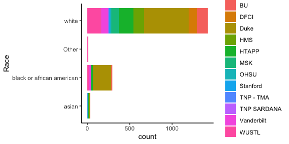
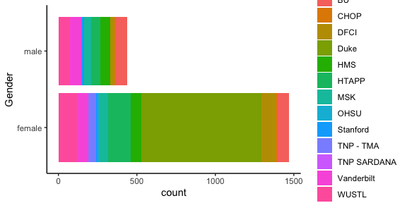

# 1. Introduction & Overview 

[HTAN](https://humantumoratlas.org/) is a National Cancer Institute (NCI)-funded Cancer Moonshot$^{SM}$ initiative to construct 3-dimensional atlases of the dynamic cellular, morphological, and molecular features of human cancers as they evolve from precancerous lesions to advanced disease ( [Cell April 2020](https://www.sciencedirect.com/science/article/pii/S0092867420303469) ).

Clinical data, sample biospecimen data and assay files in HTAN have a rich set of annotations supplied by HTAN data contributors.  These annotations are made according to the [HTAN Data model](https://data.humantumoratlas.org/standards), a set of standards defined by the HTAN consortium. The supplied values of these attributes have been collected into comprehensive data tables on the cloud, using the Google BigQuery structure that is part of Google Cloud Project.

### 1.1 Goal

This example notebook illustrates how to make use of HTAN Google BigQuery metadata tables to tabulate and plot available HTAN clinical, biospecimen, and assay metadata describing files available from [HTAN](https://data.humantumoratlas.org/). Summaries for other available metadata attributes can be generated by extending these examples.

### 1.2 Inputs, Outputs, & Data

The originating data can be found on the [HTAN Data Portal](https://data.humantumoratlas.org/), and the compiled tables are on the [Cancer Gateway in the Cloud](https://isb-cgc.appspot.com/).

### 1.3 Notes

The tables correspond to HTAN Data Version 2.

# 2. Environment & Library Setup

```r
suppressMessages(library(tidyverse))
suppressMessages(library(bigrquery))
suppressMessages(library(knitr))
```

# 3. Google Authentication

Running the BigQuery cells in this notebook requires a Google Cloud Project. Instructions for creating a project can be
found in [Google cloud documentation](https://cloud.google.com/resource-manager/docs/creating-managing-projects#console).
The instance needs to be authorized to bill the project for queries. For more information on getting started see
[Quick Start Guide to ISB-CGC](https://isb-cancer-genomics-cloud.readthedocs.io/en/latest/sections/HowToGetStartedonISB-CGC.html).
Alternative authentication methods can be found in the [Google Documentation](https://cloud.google.com/resource-manager/docs/creating-managing-projects#console).


```r
billing <- 'your_project_id' # Insert your project ID in the ''
if (billing == 'your_project_id') {
  print('Please update the project id with your Google Cloud Project')
}
```


# 4. Analyzing Clinical Data in HTAN

In the [HTAN Data model](https://data.humantumoratlas.org/standards), [Tier 1 Clinical Data](https://data.humantumoratlas.org/standard/clinical) has seven components: Demographics, Diagnosis, Exposure, Family History, Follow Up, Molecular Test, and Therapy. All HTAN demographic data is collected into a single Demographics table (*isb-cgc-bq.HTAN.clinical_tier1_demographics_current*) in Google BigQuery containing data across all [HTAN Centers](https://humantumoratlas.org/research-network). The same is true of Diagnosis, and so on.

### 4.1 Demographics

Let's look at demographic distributions in HTAN. We begin by constructing an SQL query (as a string), then sending that
as query to HTAN Google BigQuery to retrieve the Demographics table. We remove a few unneeded bookkeeping columns.


```r
sql  <- "select * from `isb-cgc-bq.HTAN.clinical_tier1_demographics_current`"
tb <- bq_project_query(billing, sql)
demographics <- bq_table_download(tb)
demographics <- demographics %>% select(-entityId,-Component,-`Data_Release`) %>% distinct()
demographics$HTAN_Center <- gsub("HTAN ","",demographics$HTAN_Center)
```

The number of rows of this table is the number of participants for which demographics is reported:
nrow(demographics)=1218. The list of IDs of all HTAN Participants with demographic annotations is


```r
participant_list <- demographics$HTAN_Participant_ID 
```

There are length(participant_list)=1218 participants with demographic annotations.

Participants per HTAN center

```r
participant_count_by_center <- demographics %>%
        select(HTAN_Center) %>%
        group_by(HTAN_Center) %>%
        tally()
participant_count_by_center %>% kable() 
```


|HTAN_Center |   n|
|:-----------|---:|
|BU          |   6|
|CHOP        |  30|
|Duke        | 680|
|HMS         | 105|
|HTAPP       | 180|
|MSK         |  87|
|Stanford    |  15|
|TNP SARDANA |   2|
|Vanderbilt  |  92|
|WUSTL       |  21|


You will see some differences between this table and the case counts on the [HTAN Data Portal]([HTAN](https://data.humantumoratlas.org/)).
(Some contributing factors: This notebook is fixed to HTAN data Release 2.0 while the portal has additional data;
the portal case inclusion criterion does not correspond to this simple row count.)

The number of columns in the Demographics table, ncol(demographics)=18, is the number of demographic
attributes. The attributes are

```r
colnames(demographics)
```

```
##  [1] "HTAN_Participant_ID"       "Ethnicity"                
##  [3] "Gender"                    "Race"                     
##  [5] "Vital_Status"              "Days_to_Birth"            
##  [7] "Country_of_Residence"      "Age_Is_Obfuscated"        
##  [9] "Year_Of_Birth"             "Occupation_Duration_Years"
## [11] "Premature_At_Birth"        "Weeks_Gestation_at_Birth" 
## [13] "Year_of_Death"             "Age_at_Index"             
## [15] "Cause_of_Death"            "Cause_of_Death_Source"    
## [17] "Days_to_Death"             "HTAN_Center"
```
These are the attributes of the HTAN [Clinical Tier 1 Demographics Data Model](https://data.humantumoratlas.org/standard/clinical),
along with a few general attributes.

#### 4.1.1 Race
Race is one of the Demographics attributes. Let's tabulate reported Race in HTAN and report the fraction as a percent. 

```r
demographics_race_reported <- demographics %>%
        filter(Race != "unknown" & Race != "Unknown" & Race != "Not Reported" & Race != "not allowed to collect" )
demographics_race_reported %>%
        group_by(Race) %>%
        tally() %>%
        mutate(Percent=round(100*n/nrow(demographics_race_reported),1)) %>%
        kable()
```


|Race                      |   n| Percent|
|:-------------------------|---:|-------:|
|asian                     |  21|     1.9|
|black or african american | 217|    19.3|
|Other                     |   2|     0.2|
|white                     | 882|    78.6|

Here is a barchart showing the distribution

```r
demographics_race_reported %>% ggplot(aes(y=Race,fill=HTAN_Center)) + 
  geom_bar() + theme_classic() 
```



#### 4.1.2 Gender

Similarly, here's a barchart showing the breakdown by Gender.


```r
demographics_gender_reported <- demographics %>% filter(Race != "Not Reported") 
demographics_gender_reported %>%
        group_by(Gender) %>%
        tally() %>%
        mutate(Percent=round(100*n/nrow(demographics),1)) %>%
        kable()
```


|Gender |   n| Percent|
|:------|---:|-------:|
|female | 955|    78.4|
|male   | 189|    15.5|


```r
demographics_gender_reported %>%
  ggplot(aes(y=Gender,fill=HTAN_Center)) +
  geom_bar() +
  theme_classic()
```



### 4.2 Treatment 

Let's take a look at annotated treatment in HTAN. This can be found in the Therapy table.


```r
sql  <- "select * from `isb-cgc-bq.HTAN.clinical_tier1_therapy_current`"
tb <- bq_project_query(billing, sql)
therapy <- bq_table_download(tb)
therapy <- therapy %>% select(-entityId,-Component,-`Data_Release`) %>% distinct()
therapy$HTAN_Center <- gsub("HTAN ","",therapy$HTAN_Center)
```

Now filter this table to retrieve instances of annotated therapy. 


```r
therapy_yes <- therapy %>%
    filter((Treatment_or_Therapy == "Yes" | !is.na(.$Treatment_Type)) & Treatment_Type != "Not Reported" & Treatment_Type != "None")
```

These are 483 in number, for 201 participants.


By center and treatment type:

```r
therapy_yes %>%
  group_by(HTAN_Center,Treatment_Type) %>%
  tally() %>% arrange(desc(n)) %>%
  kable()
```


|HTAN_Center |Treatment_Type                     |   n|
|:-----------|:----------------------------------|---:|
|MSK         |Chemotherapy                       | 100|
|HMS         |Chemotherapy                       |  59|
|MSK         |Surgery                            |  56|
|MSK         |External Beam Radiation            |  51|
|MSK         |Radiation External Beam            |  37|
|WUSTL       |Chemotherapy                       |  29|
|CHOP        |Chemotherapy                       |  25|
|WUSTL       |Surgery                            |  21|
|MSK         |Targeted Molecular Therapy         |  18|
|MSK         |Immunotherapy (Including Vaccines) |  14|
|HTAPP       |Surgery                            |  11|
|MSK         |Other                              |   9|
|MSK         |Concurrent Chemoradiation          |   7|
|OHSU        |Other                              |   7|
|OHSU        |Chemotherapy                       |   6|
|OHSU        |Hormone Therapy                    |   5|
|OHSU        |Radiation Therapy NOS              |   5|
|HTAPP       |Chemotherapy                       |   4|
|MSK         |Stereotactic Radiosurgery          |   3|
|OHSU        |Immunotherapy (Including Vaccines) |   3|
|WUSTL       |Radiation Therapy NOS              |   3|
|MSK         |Pharmaceutical Therapy NOS         |   2|
|OHSU        |Targeted Molecular Therapy         |   2|
|BU          |Chemotherapy                       |   1|
|HTAPP       |Radiation Therapy NOS              |   1|
|HTAPP       |Stereotactic Radiosurgery          |   1|
|MSK         |unknown                            |   1|
|TNP SARDANA |Chemotherapy                       |   1|
|WUSTL       |Concurrent Chemoradiation          |   1|


# 5. Analyzing Biospecimen Data in HTAN

Biospecimen data in HTAN conforms to the [Biospecimen Data](https://data.humantumoratlas.org/standard/biospecimen) standard,
and all annotated values can be obtained in a single BigQuery table.


```r
sql <- "SELECT * FROM `isb-cgc-bq.HTAN.biospecimen_current`"
tb <- bq_project_query(billing, sql)
biospecimen <- bq_table_download(tb)
biospecimen <- biospecimen %>% select(-entityId,-Component) 
biospecimen <- mutate(biospecimen,HTAN_Participant_ID=unlist(map(HTAN_Biospecimen_ID,participant_from_other_htan_id)))
```
Number of unique biospecimens : 4789, from 1228 participants.
Of these,  2280 list an HTAN Participant ID as Parent ID.

As an example, let's take a look at the various storage methods used for HTAN biospecimens

### 5.1 Storage Methods

```r
biospecimen_storage_noted <- biospecimen %>% filter(Storage_Method != "unknown" & Storage_Method != "Unknown")
table(biospecimen_storage_noted$Storage_Method,biospecimen_storage_noted$HTAN_Center) %>% kable()
```


|                          | HTAN BU| HTAN CHOP| HTAN Duke| HTAN HMS| HTAN HTAPP| HTAN MSK| HTAN Stanford| HTAN TNP SARDANA| HTAN Vanderbilt| HTAN WUSTL|
|:-------------------------|-------:|---------:|---------:|--------:|----------:|--------:|-------------:|----------------:|---------------:|----------:|
|Ambient temperature       |       0|         0|         0|      107|          0|        0|             3|                0|               0|          0|
|Fresh                     |      15|         0|         0|        0|        484|       50|             0|                0|             107|          0|
|Frozen at -150C           |       0|         0|         0|        0|         11|        0|             0|                0|               0|          0|
|Frozen at -80C            |       0|         0|         0|      222|        302|        0|             1|                0|              62|        313|
|Frozen in liquid nitrogen |       0|        34|         0|        0|         60|        7|           201|                0|               0|          0|
|Frozen in vapor phase     |       0|         0|         0|        0|         41|        0|             0|                0|               0|          0|
|Paraffin block            |       0|         0|      1006|        0|        125|       37|             0|                0|               1|          0|
|Refrigerated at 4 degrees |       0|         0|         0|      403|          0|        0|             0|               47|               0|          0|


# 6. Assay types in HTAN 

HTAN data is generated from multiple assay types, probing cancers and the tumor microenvironment at molecular, cellular, and tissue level,
using bulk, single-cell, and spatial assays. As described on the [HTAN Data Standards](https://data.humantumoratlas.org/standards)
page, generated data are arranged into data "Levels" corresponding to bioinformatic processing steps. In BigQuery, each
assay type and level is collected into a single table. Combining all of them (the query is a little long to display,
but can be seen in the code), we can tally the number of files available for each.


There are a total of 25321 annotated assay files. This is the breakdown by center and Component, which corresponds to assay type and Level. 


```r
apc_tb %>% kable()
```


|Component         |  HMS| OHSU| Stanford| WUSTL| Duke| Vanderbilt| MSK| TNP SARDANA| CHOP| HTAPP|  BU|
|:-----------------|----:|----:|--------:|-----:|----:|----------:|---:|-----------:|----:|-----:|---:|
|BulkRNA-seqLevel1 |  444|    8|      338|   232|    0|          0|   0|           0|    0|     0|   0|
|BulkRNA-seqLevel2 |  222|    2|        0|     0|    0|          0|   0|           0|    0|     0|   0|
|BulkRNA-seqLevel3 |    1|    7|        0|     0|    0|          0|   0|           0|    0|     0|   0|
|BulkWESLevel1     |    0|  144|      108|   208| 1174|        194|   0|           0|    0|     0|   0|
|BulkWESLevel2     |    0|   19|        0|     0|    0|         97|   0|           0|    0|     0|   0|
|ImagingLevel2     |  398|   61|        0|   150|  769|         30|  58|          71|    0|     0|   0|
|MolecularTest     | 1025|  124|        0|     0|  340|         92| 491|           3|   30|   207|   0|
|OtherAssay        |    0|    0|     1100|     0|    0|          0|   0|           0|    0|     0|   0|
|ScATAC-seqLevel1  |    0|    0|      640|     0|    0|          0|   0|           0|  240|     0|   0|
|ScATAC-seqLevel4  |    0|    0|        0|     0|    0|          0|   0|           0|    9|     0|   0|
|ScRNA-seqLevel1   |    0|    0|      384|   222|    0|        302| 404|           0|  204|  8796| 100|
|ScRNA-seqLevel2   |    0|    0|      128|     0|    0|        151|  57|           0|   45|  4335|  15|
|ScRNA-seqLevel3   |    0|    0|      192|     0|    0|        151| 228|           0|  135|    66|  45|
|ScRNA-seqLevel4   |    0|    0|        0|     0|    0|          4| 270|           0|   19|     0|  32|

# 7. Relevant Citations and Links 

[Cell April 2020](https://www.sciencedirect.com/science/article/pii/S0092867420303469)


